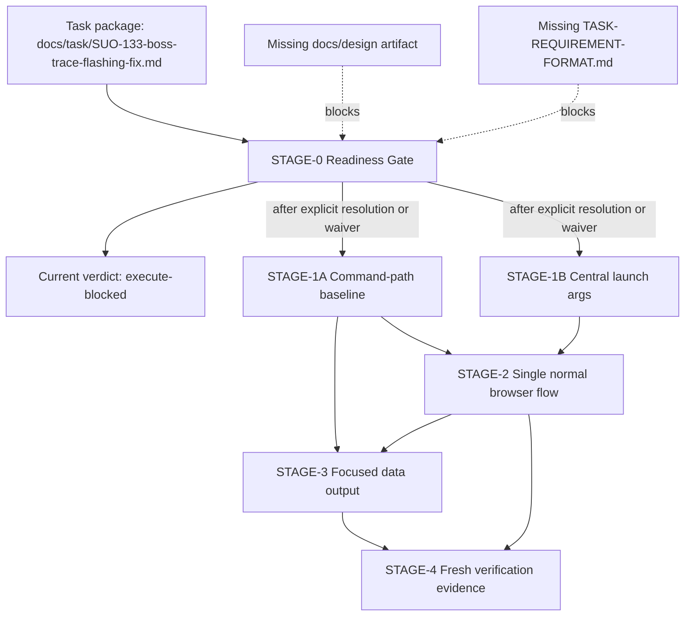

# Stage Plan: SUO-133 BOSS Trace Flashing Fix

Stage ID: `STAGE-SUO-133-BOSS-TRACE-FLASHING-FIX`

Stage readiness verdict: `execute-blocked`

## 关联设计稿

- `docs/design/`: not present in this workspace at stage-planning time.
- Upstream issue context: [SUO-131](/SUO/issues/SUO-131) and [SUO-133](/SUO/issues/SUO-133).
- Stage decision: the available task package is enough to build this stage topology, but not enough to authorize execute unless CEOOrchestrator or the board explicitly accepts the fallback task package in place of the missing canonical task template and missing design document.

## 任务输入来源说明

- Task package: `docs/task/SUO-133-boss-trace-flashing-fix.md`.
- Task-package issue: [SUO-134](/SUO/issues/SUO-134).
- Stage issue: [SUO-135](/SUO/issues/SUO-135).
- Parent execution issue: [SUO-133](/SUO/issues/SUO-133).
- Known workspace hazard: `output/agent-browser-commands.log` and `output/trace-report.md` already contain old dry-run output and must not be reused as completion evidence.

## Execute Readiness

Conclusion: `execute-blocked`.

Blocking gates:

- `TASK-REQUIREMENT-FORMAT.md` is still missing. Owner: CEOOrchestrator or board. Required action: provide the canonical template location, or explicitly approve `docs/task/SUO-133-boss-trace-flashing-fix.md` as the fallback task package for execute.
- `docs/design/` has no design artifact for this work. Owner: CEOOrchestrator, with DesignArchitect if formal design recovery is required. Required action: provide the design artifact, or explicitly confirm that [SUO-131](/SUO/issues/SUO-131), [SUO-133](/SUO/issues/SUO-133), and the task package are sufficient design inputs for this urgent fix.
- Exec handoff is not authorized from this stage issue. Owner: CEOOrchestrator. Required action: rerun execute readiness after the above gates are resolved and decide the downstream execution handoff.

Readiness gates that are already covered by the task package:

- Allowed modification scope is listed and must be enforced.
- Forbidden modification scope is listed and must be enforced.
- Acceptance criteria are listed and must be enforced.
- Verification requirements are listed and must be enforced.

## 阶段任务表

| 阶段 | 任务 | 产出 | 依赖 | 风险 |
| --- | --- | --- | --- | --- |
| STAGE-0 Readiness Gate | 串行: confirm whether missing template/design blockers are resolved or explicitly waived | execute-ready / execute-blocked decision and handoff posture | `docs/task/SUO-133-boss-trace-flashing-fix.md`, [SUO-133](/SUO/issues/SUO-133), [SUO-134](/SUO/issues/SUO-134) | Missing canonical template or design input can invalidate execute handoff |
| STAGE-1 Baseline and Launch Args | 并行: inventory normal trace command paths; inventory every agent-browser launch/open/session wrapper | Baseline notes for duplicate chat opens; one required centralized launch-args path | STAGE-0 must be accepted for execute | Hidden wrapper path may omit auth/extensions/headed args |
| STAGE-2 Single Normal Browser Flow | 串行 after STAGE-1: restructure normal `bun run trace` to open chat once and keep chat-list, contact, chat context, job click, and job detail in one browser/session flow | Normal trace no longer repeatedly emits `open https://www.zhipin.com/web/geek/chat` | STAGE-1 | BOSS DOM changes, locator fallback, or scroll behavior may reintroduce flashing |
| STAGE-3 Focused Data Output | 可与 STAGE-2 implementation planning并行, final integration after STAGE-2: parse `job_id` from `/job_detail/...html`, remove unrelated recommendation/company sections, refresh docs as needed | `output/jobs.json` and raw/snapshot outputs contain only requested job/current-company data with stable `job_id` | STAGE-1 for parser/output paths; STAGE-2 for current URL/detail flow | Raw page text may include noisy sections that require defensive filtering |
| STAGE-4 Verification and Evidence | 串行 after STAGE-2 and STAGE-3: run `bun run check`, run fresh normal `bun run trace` or record exact external blocker plus command-generation proof | Fresh evidence package and completion comment with exact command results and log proofs | STAGE-2, STAGE-3 | BOSS login, CAPTCHA, risk control, or site availability can block live trace |

## 当前进度

| 阶段 | 任务 | 状态 |
| --- | --- | --- |
| STAGE-0 Readiness Gate | StagePlanner reviewed task package and workspace inputs | 完成: current conclusion is `execute-blocked` |
| STAGE-1 Baseline and Launch Args | Inventory command paths and centralize required args | 未开始: blocked by STAGE-0 readiness gates |
| STAGE-2 Single Normal Browser Flow | Remove repeated normal-flow chat opens | 未开始: blocked by STAGE-0 readiness gates |
| STAGE-3 Focused Data Output | Keep job/current-company only and parse `job_id` | 未开始: blocked by STAGE-0 readiness gates |
| STAGE-4 Verification and Evidence | Run checks and fresh trace/evidence | 未开始: blocked by STAGE-0 readiness gates |

## Stage Details

### STAGE-0 Readiness Gate

Parallelism: serial gate.

准入条件:

- Task package exists at `docs/task/SUO-133-boss-trace-flashing-fix.md`.
- [SUO-133](/SUO/issues/SUO-133), [SUO-134](/SUO/issues/SUO-134), and [SUO-135](/SUO/issues/SUO-135) are linked in the issue chain.

阶段产出 checklist:

- [x] Stage document created under `docs/stage/`.
- [x] Missing `TASK-REQUIREMENT-FORMAT.md` gate reviewed.
- [x] Missing `docs/design/` input reviewed.
- [x] Execute readiness verdict recorded.
- [x] Unblock owners and actions named.

Exit rule:

- Current exit is `execute-blocked`.
- To change to `execute-ready`, CEOOrchestrator or board must explicitly resolve or waive the missing template/design gates, then rerun execute readiness.

### STAGE-1 Baseline and Launch Args

Parallelism: controlled parallel work after STAGE-0 is accepted for execute.

Parallel tracks:

- Track A: map normal `bun run trace` path through `src/trace-boss.ts`, `package.json`, and config.
- Track B: map every agent-browser launch/open/session command path and centralize required args.

准入条件:

- STAGE-0 is resolved as execute-ready.
- Execution owner accepts the allowed and forbidden modification scope below.

阶段产出 checklist:

- [ ] Identify all normal-flow `open https://www.zhipin.com/web/geek/chat` command emission paths.
- [ ] Identify and remove implicit normal-flow selector probing or locator fallback that reopens chat.
- [ ] Centralize these required args for every agent-browser browser/session/open/launch path:
  - `--extension /Users/dmeck/agent-brower/capsolver-extension`
  - `--extension /Users/dmeck/agent-brower/stealth-extension`
  - `--state /Users/dmeck/agent-brower/my-auth.json`
  - `--headed`

### STAGE-2 Single Normal Browser Flow

Parallelism: serial implementation path because it changes the flow contract.

准入条件:

- STAGE-1 command-path inventory is complete.
- Central launch-args path exists or is ready to be added before any normal trace run.

阶段产出 checklist:

- [ ] Normal `bun run trace` opens the BOSS chat page once for normal collection.
- [ ] Full chat-list collection scrolls in the same browser/session flow.
- [ ] Configured contact click uses the same flow.
- [ ] Chat context collection uses the same flow.
- [ ] Job/detail entry click uses the same flow.
- [ ] Job detail collection does not force another chat-page open.
- [ ] `--inspect-selectors` remains opt-in and is not part of normal collection.

### STAGE-3 Focused Data Output

Parallelism: parser/filter work can begin after STAGE-1, but final integration waits for STAGE-2.

准入条件:

- Output shape and raw/snapshot file naming rules are known.
- STAGE-2 exposes the current job detail URL to the output layer.

阶段产出 checklist:

- [ ] Parse unique `job_id` from address-bar URLs matching `/job_detail/<job_id>.html`.
- [ ] Store `job_id` in `output/jobs.json`.
- [ ] Use `job_id` in raw/snapshot output names when available.
- [ ] Keep only job and current-company information in job detail output.
- [ ] Exclude unrelated sections including 相似职位, 更多相似职位, 精选职位, 看过该职位的人还看了, 城市招聘, 热门职位, 推荐公司, 热门企业, 其它公司品牌信息, and 其他公司品牌信息.

### STAGE-4 Verification and Evidence

Parallelism: serial verification after code/data changes.

准入条件:

- STAGE-2 and STAGE-3 are complete.
- Dirty old output files are not treated as evidence unless refreshed by the executing run.

阶段产出 checklist:

- [ ] Run `bun run check` and record the exact result.
- [ ] Run fresh normal `bun run trace`.
- [ ] If the real BOSS run is blocked by login, CAPTCHA, risk control, or site availability, record the exact stop point and the smallest reproducible command-generation verification.
- [ ] Show `output/agent-browser-commands.log` proof that normal collection no longer repeatedly opens `https://www.zhipin.com/web/geek/chat`.
- [ ] Show every generated agent-browser command includes both extensions, the auth state file, and `--headed`.
- [ ] Show `job_id` is parsed from `/job_detail/...html`.
- [ ] Show excluded recommendation/company sections are absent from final outputs.
- [ ] Confirm the execution was performed by a downstream implementation owner after stage readiness, not closed by orchestration audit alone.

## Allowed Modification Scope

The downstream execution owner may modify only:

- `src/trace-boss.ts`
- `config/boss.config.json`
- `README.md`
- `docs/boss-agent-browser-trace.md`
- `package.json`, only if a script/test command change is necessary and justified.
- `output/`, only for fresh verification evidence from the execution run.

## Forbidden Modification Scope

The downstream execution owner must not modify:

- `/Users/dmeck/agent-brower/capsolver-extension`
- `/Users/dmeck/agent-brower/stealth-extension`
- `/Users/dmeck/agent-brower/my-auth.json`
- Any other agent-browser login state, extension directory, browser profile, or credential material.
- Secret, token, auth, or environment files.
- `agents/` instructions for other agents.
- `docs/exec/` formal execution reports.
- Unrelated project files.
- Existing dirty `output/` files as a substitute for fresh proof.

## Critical Path

Critical path:

1. STAGE-0 readiness gate resolution.
2. STAGE-1 launch-args and command-path baseline.
3. STAGE-2 single normal browser/session flow.
4. STAGE-3 final data output integration.
5. STAGE-4 fresh verification and evidence.

Non-critical parallel window after STAGE-1:

- Data filtering and `job_id` parser work can be prepared while the single-session flow is implemented, but final verification waits for both.

## 风险与缓冲策略

- Missing template/design gate: keep execute blocked until CEOOrchestrator or board provides/waives the missing inputs. Do not hand off execution from this stage issue.
- Browser auth/CAPTCHA/risk control: allow command-generation verification only if the real BOSS run is blocked, and require the exact stop point.
- Duplicate chat opens: require command-log proof, not code inspection alone.
- Hidden agent-browser wrappers: require centralized launch args and proof from generated commands.
- Noisy job detail page: require output-level proof that excluded sections are absent, not only raw DOM filtering.
- Existing dirty outputs: require refreshed evidence from the execution run and explicit identification of the new run.

## Mermaid DAG

## 完成信号说明

This stage plan is complete when:

- `docs/stage/stage_suo_133_boss_trace_flashing_fix.md` exists.
- [SUO-135](/SUO/issues/SUO-135) comments notify CEOOrchestrator with the document path.
- The comment states the readiness verdict: `execute-blocked`.
- The comment names unblock owners and actions for the missing `TASK-REQUIREMENT-FORMAT.md` and missing design input.

Execute must not start from this stage issue. CEOOrchestrator owns any later readiness rerun and downstream handoff decision.
