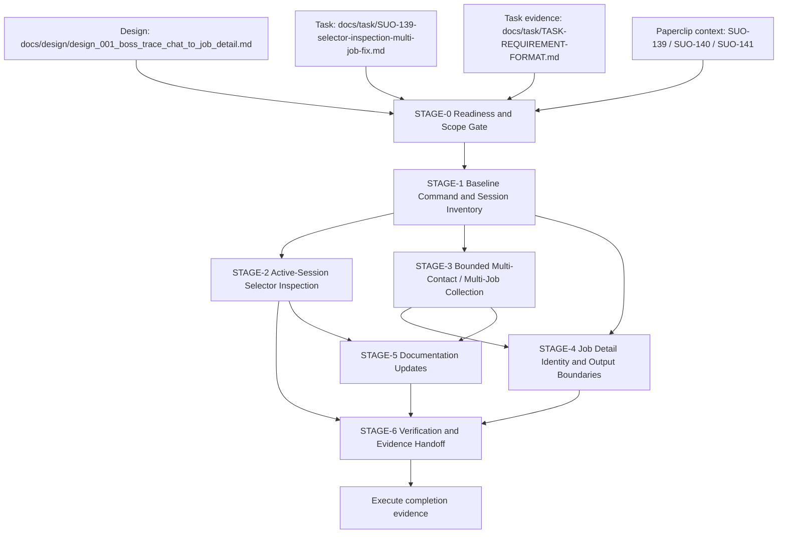

# Stage Plan: SUO-139 Selector Inspection Single-Session and Multi-Job Fix

Stage ID: `STAGE-SUO-139-SELECTOR-INSPECTION-MULTI-JOB-FIX`

Stage readiness verdict: `execute-ready`

## 关联设计稿

- Design input: `docs/design/design_001_boss_trace_chat_to_job_detail.md`
- Parent implementation issue: [SUO-139](/SUO/issues/SUO-139)
- Upstream issue: [SUO-138](/SUO/issues/SUO-138)
- Completed task package issue: [SUO-140](/SUO/issues/SUO-140)
- Stage issue: [SUO-141](/SUO/issues/SUO-141)

Design decisions carried forward:

- Normal collection is single-open and single-session.
- `--inspect-selectors` is explicit debug behavior and must not be accepted as normal completion evidence.
- Final job detail output is scoped to the current job and current company.
- `job_id` comes from the current address-bar URL after navigation to `/job_detail/<job_id>.html`.

## 任务输入来源说明

- Task package: `docs/task/SUO-139-selector-inspection-multi-job-fix.md`
- Filled task prompt/evidence: `docs/task/TASK-REQUIREMENT-FORMAT.md`
- Related prior task package: `docs/task/SUO-133-boss-trace-flashing-fix.md`
- Related prior stage plan: `docs/stage/stage_suo_133_boss_trace_flashing_fix.md`
- Related project doc for downstream documentation update: `docs/boss-agent-browser-trace.md`
- Planning-only implementation context: `src/trace-boss.ts`, `config/boss.config.json`, `README.md`, `package.json`

Input sufficiency decision:

- `docs/task/TASK-REQUIREMENT-FORMAT.md` exists and is the task-phase evidence file explicitly named by [SUO-141](/SUO/issues/SUO-141). The missing project-root `TASK-REQUIREMENT-FORMAT.md` is not a StagePlanner blocker for this handoff.
- `$PROJECT_ROOT/docs/issue/` is absent, but the Paperclip issue chain for [SUO-139](/SUO/issues/SUO-139), [SUO-140](/SUO/issues/SUO-140), and [SUO-141](/SUO/issues/SUO-141) plus the task package is sufficient issue context for stage planning.
- If CEOOrchestrator or the board later enforces a stricter root-only canonical template or local `docs/issue/` artifact policy, the unblock action is to provide that artifact or explicitly waive it before execute starts. That stricter policy is not required by the current stage issue.

## Execute Readiness

Conclusion: `execute-ready`.

Readiness gates satisfied:

- [x] Design artifact exists at `docs/design/design_001_boss_trace_chat_to_job_detail.md`.
- [x] Task package exists at `docs/task/SUO-139-selector-inspection-multi-job-fix.md`.
- [x] Filled task prompt/evidence exists at `docs/task/TASK-REQUIREMENT-FORMAT.md`.
- [x] Stage output is scoped to `docs/stage/`.
- [x] Allowed and forbidden downstream scopes are explicit.
- [x] Stage topology covers selector inspection, bounded multi-job collection, output boundaries, docs update, and verification evidence.

Execute guardrails:

- Downstream execute may start from this plan, but must not modify `docs/design/`, `docs/task/`, `docs/stage/`, `docs/issue/`, or `docs/exec/`.
- Old `output/` files are not completion evidence. Execution must refresh evidence or record an exact external blocker plus command-generation proof.
- If BOSS login, CAPTCHA, risk control, site availability, or browser/session loss blocks a live run, the execute owner must record the exact stop point and still provide command-generation, parser/filter, and launch-args proof.

## Command / Session Inventory

Current command paths observed for planning:

| Path | Mode | Current behavior | Stage requirement |
| --- | --- | --- | --- |
| `collectFullChatList(...)` -> `runBatch(...)` | `--dry-run` or missing conversation locators | Builds one `agent-browser batch` with `open <chatUrl>`, waits, snapshots, scrolls, writes chat-list evidence | Keep as bounded dry-run/diagnostic path; launch args must remain centralized and logged |
| `runSingleSessionTraceFlow(...)` -> `runBatch(...)` | normal `bun run trace` | Builds one batch with one `open <chatUrl>`, list scroll/read, configured contact clicks, first `jobEntryLocators[0]` click, detail read, optional screenshot, browser `back` between contacts | Extend to stable target iteration and bounded multi-job behavior without repeated `open chat` per target |
| `inspectKnownAreas(...)` -> repeated `runBatch(...)` | explicit `--inspect-selectors` | Loops selector groups and currently runs a fresh batch with `open <chatUrl>` for each selector count | Replace with active/current-session inspection: no close/reopen loop per selector group, task, contact, or class probe |
| `returnToChatCommands()` | normal multi-target return | Uses `back`, `wait --load networkidle`, snapshot | Keep as preferred return strategy; no `open <chatUrl>` return between configured targets |
| `agent(...)`, `runBatch(...)`, `run(...)` | all agent-browser invocations | `agent(...)` prepends `buildAgentBrowserBaseArgs(...)`; `run(...)` logs commands to `output/agent-browser-commands.log` | Preserve one centralized launch-args path and prove every generated command includes required args |

Required launch args for every `agent-browser` command path:

```text
--extension /Users/dmeck/agent-brower/capsolver-extension
--extension /Users/dmeck/agent-brower/stealth-extension
--state /Users/dmeck/agent-brower/my-auth.json
--headed
```

## 阶段任务表

| 阶段 | 任务 | 产出 | 依赖 | 风险 |
| --- | --- | --- | --- | --- |
| STAGE-0 Readiness and Scope Gate | 串行: confirm design/task inputs, issue-context sufficiency, allowed/forbidden scopes, and evidence freshness rules | `execute-ready` decision with explicit guardrails | [SUO-141](/SUO/issues/SUO-141), design doc, task package, `docs/task/TASK-REQUIREMENT-FORMAT.md` | Stricter board policy could later require root `TASK-REQUIREMENT-FORMAT.md` or local `docs/issue/` artifact |
| STAGE-1 Baseline Command and Session Inventory | 串行 first, with implementation notes: map all `agent-browser` command paths, launch args, command logging, open-chat emission, and mode boundaries | Command/session baseline and exact target changes for execute owner | STAGE-0 | Hidden wrapper or future path could omit required launch args or create repeated opens |
| STAGE-2 Active-Session Selector Inspection | 串行 after STAGE-1: change inspection to reuse active/current session and isolate debug evidence | `--inspect-selectors` no longer opens/reopens chat per selector group/probe; inspection evidence is debug-labeled | STAGE-1 command inventory | Selector probes may disturb page state or be mistaken for normal completion evidence |
| STAGE-3 Bounded Multi-Contact / Multi-Job Collection | 可与 STAGE-2 design details并行 after STAGE-1, final integration serial: define target schema/limits and iterate without repeated chat opens | Configured finite targets with stable `target_id`; bounded job entry attempts; no repeated chat open per target | STAGE-1; normal flow command shape | Scope creep into broad crawling; target failure may incorrectly abort whole batch |
| STAGE-4 Job Detail Identity and Output Boundaries | 并行 after STAGE-1, final verification after STAGE-3: keep URL-derived `job_id` and current job/current company output only | `jobs.json`, raw text, snapshots, and trace events contain `target_id`, `job_id`, URL, and excluded-section proof | STAGE-1; STAGE-3 current URL/detail flow | Raw page text may include recommendation/hot/other-company sections |
| STAGE-5 Documentation Updates | 可与 STAGE-2/STAGE-3 implementation并行: update README and trace doc to match interaction rules and limits | README and `docs/boss-agent-browser-trace.md` document inspection rule, multi-job limit, stop behavior, and evidence requirements | STAGE-2/STAGE-3 decisions | Docs may overpromise behavior not proven by verification |
| STAGE-6 Verification and Evidence Handoff | 串行 final: run checks and fresh trace/inspection evidence, or document exact external blocker with command-generation proof | `bun run check` result, inspection evidence, command-log proof, multi-job evidence, blocker report if needed | STAGE-2, STAGE-3, STAGE-4, STAGE-5 | Live BOSS run may be blocked by login, CAPTCHA, risk control, or site availability |

## 当前进度

| 阶段 | 任务 | 状态 |
| --- | --- | --- |
| STAGE-0 Readiness and Scope Gate | StagePlanner reviewed design, task package, task evidence, issue context, and workspace inputs | 完成: `execute-ready` |
| STAGE-1 Baseline Command and Session Inventory | Inventory current command paths and required launch args | 完成: baseline captured in this stage plan; execute owner must verify against edited code |
| STAGE-2 Active-Session Selector Inspection | Remove per-selector open/close/reopen loop in inspection mode | 未开始: downstream execute |
| STAGE-3 Bounded Multi-Contact / Multi-Job Collection | Add/confirm finite target iteration and no repeated chat open per target | 未开始: downstream execute |
| STAGE-4 Job Detail Identity and Output Boundaries | Preserve `target_id` + URL-derived `job_id`; exclude unrelated sections | 未开始: downstream execute |
| STAGE-5 Documentation Updates | Update README and trace doc | 未开始: downstream execute |
| STAGE-6 Verification and Evidence Handoff | Run check, inspection, command-log proof, and multi-job evidence | 未开始: downstream execute |

## Stage Details

### STAGE-0 Readiness and Scope Gate

Parallelism: serial gate.

准入条件:

- [SUO-141](/SUO/issues/SUO-141) is checked out by StagePlanner.
- Design and task package inputs exist.
- Stage output path is `docs/stage/stage_suo_139_selector_inspection_multi_job_fix.md`.

阶段产出 checklist:

- [x] Stage document created under `docs/stage/`.
- [x] `TASK-REQUIREMENT-FORMAT.md` availability evaluated.
- [x] Missing `docs/issue/` evaluated.
- [x] Execute readiness verdict recorded.
- [x] Allowed and forbidden downstream scopes recorded.

Exit rule:

- Current exit is `execute-ready`.
- If a stricter canonical-input policy is applied later, CEOOrchestrator or the board owns providing/waiving project-root `TASK-REQUIREMENT-FORMAT.md` or local `docs/issue/` before execute.

### STAGE-1 Baseline Command and Session Inventory

Parallelism: serial before behavior changes.

准入条件:

- STAGE-0 is `execute-ready`.
- Execute owner accepts the allowed and forbidden modification scopes.

阶段产出 checklist:

- [x] Identify `collectFullChatList(...)` dry-run/no-locator batch path.
- [x] Identify `runSingleSessionTraceFlow(...)` normal trace batch path.
- [x] Identify `inspectKnownAreas(...)` explicit inspection path.
- [x] Identify `returnToChatCommands()` browser-back return path.
- [x] Identify centralized `agent(...)` / `runBatch(...)` / `run(...)` launch and logging path.
- [ ] During execute, re-run the inventory after edits and include proof in completion evidence.

Execution notes:

- Normal mode may have one `open https://www.zhipin.com/web/geek/chat` for the collection trajectory.
- Dry-run may have one diagnostic `open chat` and must not be confused with normal multi-target collection evidence.
- Inspection mode must not use one fresh `open chat` per selector group or selector probe.
- `output/agent-browser-commands.log` must prove each generated `agent-browser` command includes both extensions, the auth state, and `--headed`.

### STAGE-2 Active-Session Selector Inspection

Parallelism: serial, because inspection behavior touches browser/session lifecycle.

准入条件:

- STAGE-1 command inventory is complete.
- Execute owner has identified the current-session handle/batch strategy for selector inspection.

阶段产出 checklist:

- [ ] Keep `--inspect-selectors` as explicit opt-in only.
- [ ] Do not call broad inspection from normal `bun run trace`.
- [ ] Replace per-selector `open <chatUrl>` loops with active/current-session selector reads/counts.
- [ ] Do not close/reopen the browser per selector group, task, contact, or class probe.
- [ ] Write inspection output as debug evidence, such as `output/selector-inspection.json` or `selector-inspection-*` trace events.
- [ ] Ensure inspection evidence is not counted as normal flow completion evidence.
- [ ] Record failed selector probes with group, selector, current URL, count/result, and failure reason.

### STAGE-3 Bounded Multi-Contact / Multi-Job Collection

Parallelism: implementation can proceed beside STAGE-2 after STAGE-1, but final integration waits for shared flow decisions.

准入条件:

- STAGE-1 proves the normal path can run as one batch/session trajectory.
- Config target schema or backward-compatible traversal rule is chosen.

阶段产出 checklist:

- [ ] Prefer an explicit finite `traceTargets` schema with stable target ids, or document backward-compatible traversal of `conversationEntryLocators` plus bounded `jobEntryLocators`.
- [ ] Enforce a configured upper bound for contacts and job entries per contact.
- [ ] Generate stable `target_id` for every attempted contact/job target.
- [ ] Write `target_id` to `output/chats.json`, `output/jobs.json`, and trace events.
- [ ] Use browser `back` or an equivalent same-session return path between targets.
- [ ] Do not repeatedly `open https://www.zhipin.com/web/geek/chat` for each target.
- [ ] A single target/job failure records evidence and continues when safe.
- [ ] Abort the whole batch only for login, CAPTCHA, risk control, site availability, or browser/session failure.

### STAGE-4 Job Detail Identity and Output Boundaries

Parallelism: parser/filter work can begin after STAGE-1; final acceptance waits for STAGE-3 flow data.

准入条件:

- Current detail URL is captured for each job attempt.
- Output naming and trace event structure can carry `target_id` and `job_id`.

阶段产出 checklist:

- [ ] Parse `job_id` only from current URL matching `/job_detail/<job_id>.html`.
- [ ] Store `target_id`, `job_id`, `url`, `collectedAt`, `rawTextFile`, and `snapshotFile` in every successful `jobs.json` record.
- [ ] Prefer `job_id` in raw/snapshot filenames, such as `output/raw/job-<job_id>.txt`.
- [ ] Keep final job detail output scoped to current job and current company.
- [ ] Exclude 相似职位, 更多相似职位, 精选职位, 看过该职位的人还看了, 城市招聘, 热门职位, 推荐公司, 热门企业, 其它公司品牌信息, and 其他公司品牌信息.
- [ ] Verify exclusion in `jobs.json`, raw job text, and snapshot evidence, not only in one output view.

### STAGE-5 Documentation Updates

Parallelism: parallel after STAGE-2 and STAGE-3 behavior decisions are concrete.

准入条件:

- Execute owner knows final inspection interaction behavior and multi-job limit/stop behavior.
- Documentation changes stay within allowed downstream scope.

阶段产出 checklist:

- [ ] `README.md` explains that normal trace is single-session and inspection is explicit debug behavior.
- [ ] `README.md` explains configured multi-target limits and stop/continue behavior.
- [ ] `docs/boss-agent-browser-trace.md` explains selector inspection must happen inside the existing session and must not close/reopen per probe.
- [ ] `docs/boss-agent-browser-trace.md` explains multi-job collection remains bounded and configuration-driven.
- [ ] Documentation does not cite stale `output/` files as evidence.

### STAGE-6 Verification and Evidence Handoff

Parallelism: serial final stage.

准入条件:

- STAGE-2 through STAGE-5 are complete.
- Old `output/` evidence has been cleared, overwritten by the fresh run, or explicitly excluded from completion evidence.

阶段产出 checklist:

- [ ] Run `bun run check` and record the exact result.
- [ ] Run fresh `bun run trace -- --inspect-selectors`, or record an exact external blocker plus command-generation proof.
- [ ] Provide command-log proof that inspection mode does not repeatedly emit `open https://www.zhipin.com/web/geek/chat` per selector probe/task.
- [ ] Provide command-log proof that every `agent-browser` command includes both extensions, `--state /Users/dmeck/agent-brower/my-auth.json`, and `--headed`.
- [ ] Provide multi-job attempt/collection evidence: multiple configured targets/jobs collected, or precise proof only one qualifying entry exists in the live page.
- [ ] Provide `output/jobs.json` proof of stable `target_id` and URL-derived `job_id`.
- [ ] Provide raw/snapshot/job JSON proof that excluded recommendation/hot/other-company sections are absent.
- [ ] If live BOSS is blocked, record exact blocker type, URL/state, trace event, and smallest local verification that still proves command generation and parser/filter logic.

## Allowed Modification Scope

Downstream execute may modify only:

- `src/trace-boss.ts`
- `config/boss.config.json`
- `README.md`
- `docs/boss-agent-browser-trace.md`
- `package.json`, only if a necessary script/test command change is justified
- `output/`, only for fresh verification evidence

## Forbidden Modification Scope

Downstream execute must not modify:

- `docs/design/`
- `docs/issue/`
- `docs/task/`
- `docs/stage/`
- `docs/exec/`
- `/Users/dmeck/agent-brower/capsolver-extension`
- `/Users/dmeck/agent-brower/stealth-extension`
- `/Users/dmeck/agent-brower/my-auth.json`
- Any secret, token, auth state, browser profile, or extension material
- Unrelated project files
- Old `output/` files as completion evidence

## Critical Path

Critical path:

1. STAGE-0 readiness and scope gate.
2. STAGE-1 command/session inventory.
3. STAGE-2 active-session selector inspection fix.
4. STAGE-3 bounded multi-contact/multi-job collection integration.
5. STAGE-4 job detail identity and output-boundary integration.
6. STAGE-6 verification and evidence handoff.

Non-critical or parallel windows:

- STAGE-4 parser/filter work can begin after STAGE-1 while STAGE-2/STAGE-3 flow changes are underway.
- STAGE-5 documentation can proceed once STAGE-2/STAGE-3 behavior decisions are stable, but final docs must match verified behavior.

## 风险与缓冲策略

- Active-session inspection risk: selector probing can mutate page state. Buffer by making inspection debug-scoped, recording current URL/state before probes, and avoiding per-probe open/reopen loops.
- Multi-job scope risk: the requirement can drift into broad crawling. Buffer by using finite configured targets, max-per-contact limits, and stable `target_id` records.
- Command wrapper risk: a hidden `agent-browser` path can omit launch args. Buffer by preserving one `agent(...)` entry point and verifying the generated command log.
- Repeated chat-open regression risk: code inspection alone is insufficient. Buffer by requiring command-log proof for normal and inspection modes.
- BOSS external blocker risk: login, CAPTCHA, risk control, or site availability may block live proof. Buffer by recording exact stop point plus command-generation and parser/filter verification.
- Output contamination risk: raw page text may include recommendation or unrelated company sections. Buffer by requiring exclusion proof across raw, snapshot, and structured job outputs.
- Stale evidence risk: old `output/` files can look valid. Buffer by requiring fresh timestamps/run evidence or explicit external-blocker evidence.

## Mermaid DAG



## 完成信号说明

This stage plan is complete when:

- `docs/stage/stage_suo_139_selector_inspection_multi_job_fix.md` exists.
- [SUO-141](/SUO/issues/SUO-141) receives a completion comment with the stage document path.
- The comment states readiness verdict `execute-ready`.
- The comment mentions [@CEOOrchestrator](agent://1e68c2e7-57cc-4e9e-88c8-3b4432fd6249) to continue execute readiness decision and downstream handoff.

Downstream execute must finish with:

- Changed file list.
- Exact verification command results.
- Fresh command-log proof for launch args and open-count behavior.
- Fresh inspection and multi-job evidence, or exact external blocker plus command-generation proof.
- Updated README and `docs/boss-agent-browser-trace.md` paths.
