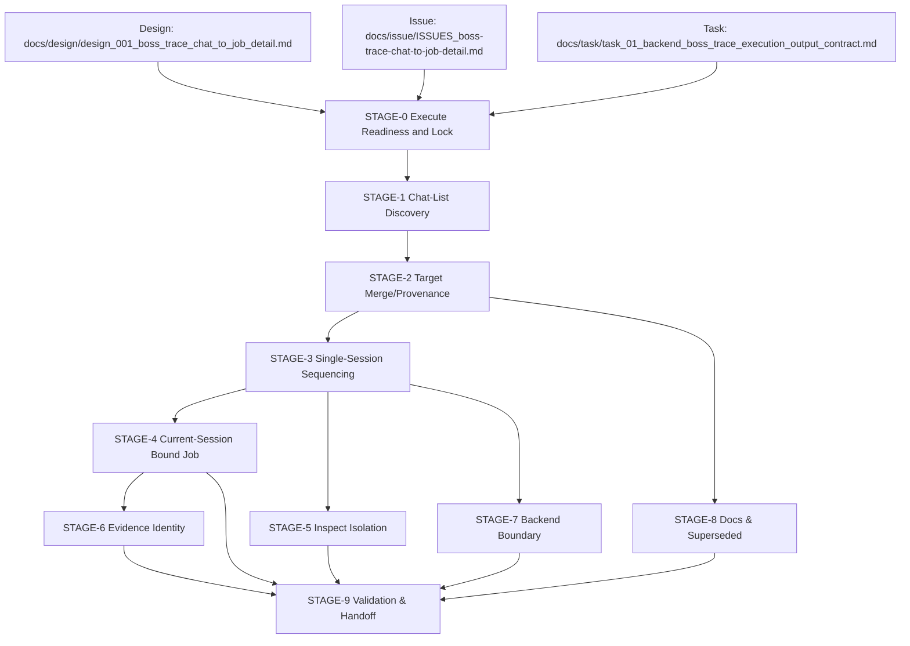

# Stage Plan: SUO-150 BOSS Trace Per-Contact Chain (Execution Baseline, Left-Panel Contract)

Stage ID: `STAGE-SUO-150-BOSS-TRACE-PER-CONTACT-CHAIN`

Stage readiness verdict: `execute-ready`

## 关联设计稿

- [design_001_boss_trace_chat_to_job_detail.md](/Users/dmeck/project/boss-agent/docs/design/design_001_boss_trace_chat_to_job_detail.md)

## 任务输入来源说明

- [SUO-166 continuation summary]（本次 issue 重排上下文）
- [issue 列表](/Users/dmeck/project/boss-agent/docs/issue/ISSUES_boss-trace-chat-to-job-detail.md)
- [task 任务包](/Users/dmeck/project/boss-agent/docs/task/task_01_backend_boss_trace_execution_output_contract.md)
- [stage 现有历史](/Users/dmeck/project/boss-agent/docs/stage/stage_suo_162_boss_trace_left_panel_coverage_contract.md), (/Users/dmeck/project/boss-agent/docs/stage/stage_suo_159_boss_trace_left_panel_recovery.md)

本计划更新目标：将现有 per-contact chain 执行门禁改为“左侧聊天列表全量逐对话覆盖 + single-session normal + current-session bound job + debug-only inspect”，并保持 stage 与 exec 边界。

输入完整性判定:

- 设计稿与 issue/task 输入已可读且明确指向左侧列表为 normal-flow source-of-truth。
- `leftIndex`、`targetProvenance`、`target_id` 和 `job_id` 派生口径已在输入中明示。
- 执行边界清晰：stage 不直接产出 exec 结果。

## 职责边界（Issue / Task / Stage / Exec）

- `Issue`：定义目标、优先级、依赖与交付条件（如 BTR-01/BTR-02/BTR-03）。
- `Task`：产出 backend task 包（`docs/task/...`）和实现接口约束。
- `Stage`（本文件）：将 task 收敛为可执行顺序、并行关系、门禁与交付清单。
- `Exec`：承担代码落地后的 fresh 运行与证据验证（不由 Stage 直接执行）。

## 当前进度

| 阶段 | 任务 | 状态 |
| --- | --- | --- |
| STAGE-0 Execute Readiness and Lock | 输入一致性与范围冻结 | 完成 |
| STAGE-1 Chat-List Discovery as Source-of-Truth | 左侧会话列表作为覆盖源 | 未开始 |
| STAGE-2 Target Merge and Provenance Freeze | `traceTargets` 仅作覆盖，不再收窄目标 | 未开始 |
| STAGE-3 Single-Session Normal Trace Sequencing | one-open normal 主链路编排 | 未开始 |
| STAGE-4 Current-Session Bound Job Rule | 每目标仅首个当前会话绑定岗位 | 未开始 |
| STAGE-5 Inspect Isolation Gate | `--inspect-selectors` debug-only gate | 未开始 |
| STAGE-6 Evidence Identity Contract | `target_id/leftIndex/targetProvenance/job_id` 写入 artifact | 未开始 |
| STAGE-7 Backend Boundary | orchestration/command/parser/output 分层约束 | 未开始 |
| STAGE-8 Docs & Superseded Hygiene | 与 BTR-02 同步 superseded 及边界 | 未开始 |
| STAGE-9 Validation & Exec Handoff | fresh evidence 与执行门禁复核 | 未开始 |

## 阶段任务表

| 阶段 | 任务 | 产出 | 依赖 | 风险 |
| --- | --- | --- | --- | --- |
| STAGE-0 Execute Readiness and Lock | 串行：锁定 SUO-166 重排目标、确认 all-left-panel 合同可执行，确认只写 `docs/stage/` | execute-ready 与门禁声明 | design/issue/task 输入 | 输入版本漂移导致旧假设复燃 |
| STAGE-1 Chat-List Discovery as Source-of-Truth | 串行：以 `COLLECT_CHAT_LIST` 作为 normal target baseline（bounded by scroll config） | `left-panel` 覆盖序列（按发现顺序） | STAGE-0 | 左侧滚动列表漂移、虚拟列表重排 |
| STAGE-2 Target Merge and Provenance Freeze | 串行：按 locator 去重与顺序合并 `traceTargets`/`conversationEntryLocators`（compat overlay） | `resolvedTargets`（`target_id`、`leftIndex`、`targetProvenance`） | STAGE-1 | 兼容输入被误用成收窄条件 |
| STAGE-3 Single-Session Normal Trace Sequencing | 串行：规划 normal flow：open chat 一次 + per-conversation sequential chain + in-session return/back + no repeated open | 单会话主链路执行规范与失败后续策略 | STAGE-2 | 重复 open 导致闪烁回归 |
| STAGE-4 Current-Session Bound Job Rule | 串行：每个 target 只接受当前会话绑定的首个有效岗位；失败则 `job-not-collected` 并继续 | 单目标单 job 规则与 continue-vs-abort 规则 | STAGE-3 | 非阻塞失败被误 abort 全局 |
| STAGE-5 Inspect Isolation Gate | 串行：`--inspect-selectors` 不参与 normal completion，且使用同一 resolved target cardinality | debug-only 证据边界与证据归类规则 | STAGE-3 | inspect 被混淆为正常完成证据 |
| STAGE-6 Evidence Identity Contract | 并行：锁定 chats/jobs/events 的身份字段与 URL-derived `job_id` 语义 | audit-ready artifact schema 和过滤边界 | STAGE-2, STAGE-4 | URL 解析失败导致误采样 |
| STAGE-7 Backend Boundary | 并行：明确 parser/filter/output 不再集中在 `src/trace-boss.ts`，命令构建分层可见 | backend 接口边界清单 | STAGE-0, STAGE-3 | 范围过大导致重构回归 |
| STAGE-8 Docs & Superseded Hygiene | 并行：将 stage/issue/task/README/指南对齐到 all-left-panel 与 per-conversation 合同 | `superseded` 清单与一致性核验点 | STAGE-3/6/7 | 文档超承诺（快于验证） |
| STAGE-9 Validation & Exec Handoff | 串行：保持 execute readiness gate，禁止跳过验证并生成 handoff 条件 | 执行前置条件、阻塞路径、验收点 | STAGE-3, STAGE-4, STAGE-5, STAGE-6, STAGE-8 | 外部 blocker（登录/CAPTCHA/风控/会话丢失） |

## STAGE-0 Execute Readiness and Lock

并行/串行标记: 串行。

准入条件:

- 设计稿、issue 清单、任务包输入已读取且版本一致。
- `docs/issue` 与 `task` 中左侧逐对话覆盖规则为当前 source-of-truth。
- 输出范围仅允许 `docs/stage/`。

阶段产出 checklist:

- [x] 已确认 `SUO-166` 重排目标：以 left-panel discovery 作为覆盖源。
- [x] 已确认 `STAGE` 仍保持 execute readiness gate，不跳转 exec。
- [x] 已明确下游交付顺序：BTR-01/02/03（与 exec 依赖分离）。

Exit rule:

- `STAGE-0` 不可跳过；未满足则 issue 保持 blocked 并要求补齐输入。

## STAGE-1 Chat-List Discovery as Source-of-Truth

并行/串行标记: 串行。

准入条件:

- STAGE-0 完成。

阶段产出 checklist:

- [ ] 明确 `open https://www.zhipin.com/web/geek/chat` 仅用于 normal 的单次入口。
- [ ] 明确 left-panel collection 的顺序、去重键与 `leftIndex` 规则。
- [ ] 明确 `chat-list` 失效时 `fallback` 兼容路径的触发条件。

## STAGE-2 Target Merge and Provenance Freeze

并行/串行标记: 串行。

准入条件:

- STAGE-1 的覆盖序列已定义。

阶段产出 checklist:

- [ ] 明确 `traceTargets` 与 `conversationEntryLocators` 仅为 compatibility/override，不可替代或收窄 discovered target set。
- [ ] 标注 `targetProvenance`：`discovered` / `fallback` / `config-only`。
- [ ] 标注 `config-only` 未命中事件和告警（`trace-target-not-found`）。

## STAGE-3 Single-Session Normal Trace Sequencing

并行/串行标记: 串行。

准入条件:

- STAGE-2 完成。

阶段产出 checklist:

- [ ] normal flow 轨迹：`COLLECT_CHAT_LIST -> BUILD_TARGET_SET -> PER_TARGET(contact/chat/job/return)`。
- [ ] 每目标执行在同一 browser/session：`select contact -> collect chat -> collect first current-bound job -> return back`。
- [ ] 禁止目标间重复 open chat。
- [ ] 只在 external blocker 时 abort（登录/CAPTCHA/风控/站点不可用）。

## STAGE-4 Current-Session Bound Job Rule

并行/串行标记: 串行。

准入条件:

- STAGE-3 的 session loop 可执行。

阶段产出 checklist:

- [ ] 每 `target_id` 仅接受第一条可绑定当前会话的 `jobEntryLocator`。
- [ ] 明确过滤：`job_sug_*`、`/recommend/`、未知岗位不形成 normal 成功证据。
- [ ] 记录 `job-not-collected` 并继续下一目标，不得无条件终止。

## STAGE-5 Inspect Isolation Gate

并行/串行标记: 串行。

准入条件:

- STAGE-3 的 session 生命周期已冻结。

阶段产出 checklist:

- [ ] `--inspect-selectors` 为显式 opt-in 且 debug-only。
- [ ] inspect 使用 normal 已解析目标集，cardinality 不回退到单 target。
- [ ] inspect 证据不得计入 normal flow 完成条件。

## STAGE-6 Evidence Identity Contract

并行/串行标记: 并行后收敛。

准入条件:

- STAGE-2 与 STAGE-4 语义可映射 artifact。

阶段产出 checklist:

- [ ] `output/chats.json` 和 `output/jobs.json` 包含 `target_id`、`leftIndex`（可发现时）、`targetProvenance`。
- [ ] `output/jobs.json` 的 `job_id` 仅来自当前 URL `/job_detail/<id>.html`。
- [ ] 记录 `(target_id, job_id)` 去重与 `job-duplicate-skipped`。
- [ ] 过滤 recommendation / 热门 / 相似职位等噪声区块。

## STAGE-7 Backend Boundary

并行/串行标记: 并行。

准入条件:

- STAGE-3 已给出 session 与目标序列执行线。

阶段产出 checklist:

- [ ] `src/trace-boss.ts` 限制为入口调度；目标解析、命令构建、parser、output 具备明确边界。
- [ ] `agent-browser` launch 命令参数来自统一构建点（required args 全链路一致）。

## STAGE-8 Docs & Superseded Hygiene

并行/串行标记: 并行。

准入条件:

- STAGE-3/6/7 约束稳定。

阶段产出 checklist:

- [ ] 通过 BTR-02 同步：`leftIndex`、`targetProvenance`、`target_id`、`job_id`、single-session、single-job、inspect debug-only。
- [ ] 明确旧“单 target / limited target”叙事标记为 `superseded`。

## STAGE-9 Validation & Exec Handoff

并行/串行标记: 串行。

准入条件:

- STAGE-4 到 STAGE-8 收敛完成。

阶段产出 checklist:

- [ ] 保留 execute readiness 复核，明确执行前置和阻塞 gate。
- [ ] 输出 `bun run check` / `bun run trace:dry` / `bun run trace` / `bun run trace -- --inspect-selectors` 的执行条件与期望证据。
- [ ] 证据要求：single-open / single-session / one-job-per-target / same target cardinality in inspect / 左侧覆盖链可追溯。
- [ ] `in_progress` -> `BTR-01/02/03` handoff 路径清晰，未出现 exec 混淆。

## 关键路径

1. STAGE-0 Execute Readiness and Lock
2. STAGE-1 Chat-List Discovery as Source-of-Truth
3. STAGE-2 Target Merge and Provenance Freeze
4. STAGE-3 Single-Session Normal Trace Sequencing
5. STAGE-4 Current-Session Bound Job Rule
6. STAGE-6 Evidence Identity Contract
7. STAGE-5 Inspect Isolation Gate
8. STAGE-9 Validation & Exec Handoff

## 风险与缓冲策略

- 左侧会话列表漂移：保留 `chat-list` 证据，按 locator-signature 去重，`leftIndex` 在可发现范围内固定。
- 重复 open 风险：在 STAGE-3 置顶检查项，“目标间禁止再次 open chat”。
- inspect 混用风险：STAGE-5 强制 debug-only 与 cardinality 一致检查。
- 外部阻塞风险：登录/CAPTCHA/风险控制/会话丢失导致无法完成 live run 时，必须记录 stop-point 与最小命令验证路径。

## Mermaid DAG

## 完成信号说明

- `docs/stage/stage_suo_150_boss_trace_per_contact_chain_backend.md` 已更新为 SUO-166 目标：left-panel 全量逐对话发现、single-session normal、current-session bound job、debug-only inspect。
- `execute-readiness` 门禁仍保留，且列为 STAGE-0 与 STAGE-9 的阻断条件。
- 文档职责边界已明确：`issue/task/stage/exec` 仅在其职责域内。
- 下游 handoff 指向 BTR-01（实现）→ BTR-02（文档）→ BTR-03（验证/执行收口）。
