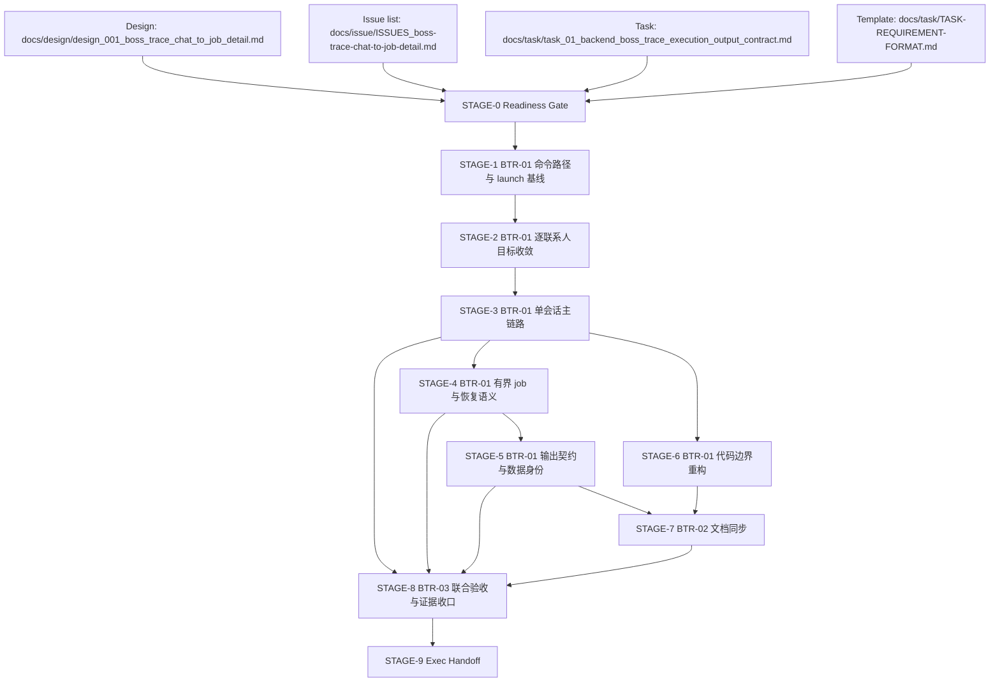

# Stage Plan: SUO-150 BOSS Trace Per-Contact Chain Backend + Docs + Validation

Stage ID: `STAGE-SUO-150-BOSS-TRACE-PER-CONTACT-CHAIN`

Stage readiness verdict: `execute-ready`

Execution readiness check summary:

- 输入完整且一致（设计稿、任务包、Issue 清单、任务提示词文件齐备）。
- 上下文中已明确 `BTR-01`、`BTR-02`、`BTR-03` 的边界与交付顺序。
- 当前判定：`execute-ready`。

## 关联设计稿

- `docs/design/design_001_boss_trace_chat_to_job_detail.md`
- `docs/issue/ISSUES_boss-trace-chat-to-job-detail.md`

## 任务输入来源说明

- 任务包：`docs/task/task_01_backend_boss_trace_execution_output_contract.md`（BTR-01）
- 任务提示词：`docs/task/TASK-REQUIREMENT-FORMAT.md`
- 兼容上下文：`docs/task/SUO-139-selector-inspection-multi-job-fix.md`、`docs/task/SUO-133-boss-trace-flashing-fix.md`
- 运行与文档上下文：`README.md`、`docs/boss-agent-browser-trace.md`
- 关联 Stage 参考：`docs/stage/stage_suo_139_selector_inspection_multi_job_fix.md`

Input sufficiency decision:

- 所需输入文件均可读。
- 设计与 task/issue 输入支持将 `BTR-01`、`BTR-02`、`BTR-03` 在 stage 中分立追踪。

## 阶段任务表

| 阶段 | 任务 | 产出 | 依赖 | 风险 |
| --- | --- | --- | --- | --- |
| STAGE-0 Readiness Gate | 串行: 确认任务来源、边界、输入齐备与执行门禁 | `execute-ready` 判定与三 issue 对齐结论 | 设计稿、任务包、Issue 清单、TASK-REQUIREMENT-FORMAT | 输入误读导致 stage 作用域偏移 |
| STAGE-1 BTR-01 命令路径与 launch 基线 | 串行: 完成 normal / dry / inspect 路径命令入口盘点，确认 base args 唯一入口 | `agent-browser` 基线清单与 required args 合规规则 | STAGE-0 | 漏审计入口导致参数不一致 |
| STAGE-2 BTR-01 逐联系人目标收敛 | 串行: 落实 `traceTargets` 优先、兼容回退、`target_id` 与任务顺序定义 | `target` 目标集合、`target_id` 规则、每目标 job 上限输入契约 | STAGE-1 | 目标规约歧义导致 `chats/jobs` 可追溯性丢失 |
| STAGE-3 BTR-01 单会话主链路 | 串行: 打造一次 open 的 normal flow（chat list -> target -> jobs -> return） | 单会话采集主链路定义（不重开 chat） | STAGE-1, STAGE-2 | 回归到重复 open chat 的旧路径 |
| STAGE-4 BTR-01 有界 job 与恢复语义 | 串行: 落地 `maxJobs`/`maxJobsPerTarget`、失败跳过、外部 blocker 终止规则 | 执行序列规则与 `trace-events` 失败事件标准 | STAGE-3 | 无条件 abort 误杀非外部失败 |
| STAGE-5 BTR-01 输出契约与数据身份 | 串行: 锁定 `target_id`、`job_id`、`jobs.json/chats.json` 字段/去重与过滤边界 | 可追溯的 output 契约与噪声过滤证据口径 | STAGE-3 | URL 解析或过滤错位影响验收 |
| STAGE-6 BTR-01 代码边界重构（backend） | 并行: 拆分 orchestration/commands/output/parser 边界，维持统一调用入口 | `src/trace-boss.ts` + 拆分边界提案（`targets.ts`/`commands.ts`/`output.ts`/`parser.ts`） | STAGE-1, STAGE-3 | 大拆分引入行为漏改 |
| STAGE-7 BTR-02 文档同步 | 并行: 更新 `README.md` 与 `docs/boss-agent-browser-trace.md` 到逐联系人链路契约 | 文档表述与 evidence 口径与 design/task 一致；旧假设标为 superseded | STAGE-2, STAGE-3, STAGE-5 | 文档与实现脱节 |
| STAGE-8 BTR-03 联合验收与证据收口 | 串行: 验证 BTR-01+ BTR-02 收敛后形成可执行 handoff 信号 | `bun run check`、`bun run trace:dry`、`bun run trace`、可选 `--inspect-selectors` 证据路径 | STAGE-3, STAGE-4, STAGE-5, STAGE-6, STAGE-7 | 外部 blocker 导致 live 证据无法完成 |
| STAGE-9 Exec Handoff | 串行: 对下游 `ExecTaskAgent` 输出准入条件并提交 handoff | `execute-ready` 与验收门禁清单 | STAGE-8 | 准入条件表达不清导致重复返工 |

## 当前进度

| 阶段 | 任务 | 状态 |
| --- | --- | --- |
| STAGE-0 Readiness Gate | 确认 `SUO-150` 分工边界、输入齐备与 issue 拆分对齐 | 完成: 输入充分，判定 `execute-ready` |
| STAGE-1 BTR-01 命令路径与 launch 基线 | 识别并统一 `agent-browser` command/log 基线入口 | 未开始: downstream execute |
| STAGE-2 BTR-01 逐联系人目标收敛 | 完成 `traceTargets`/`conversationEntryLocators` 合并规则与 `target_id` 规则 | 未开始: downstream execute |
| STAGE-3 BTR-01 单会话主链路 | 确保 normal flow 单 open 单会话 | 未开始: downstream execute |
| STAGE-4 BTR-01 有界 job 与恢复语义 | 落地边界与 continue-vs-abort 行为 | 未开始: downstream execute |
| STAGE-5 BTR-01 输出契约与数据身份 | 落地 `target_id`/`job_id` 与过滤规则执行标准 | 未开始: downstream execute |
| STAGE-6 BTR-01 代码边界重构（backend） | 输出 backend helper 边界拆分方案与迁移清单 | 未开始: downstream execute |
| STAGE-7 BTR-02 文档同步 | 在文档中同步逐联系人链路与 supersede 注记 | 未开始: downstream execute |
| STAGE-8 BTR-03 联合验收与证据收口 | 完成 check/trace 证据与 evidence 边界 | 未开始: downstream execute |
| STAGE-9 Exec Handoff | 向 ExecTaskAgent 发起可执行 handoff 与确认项 | 未开始: downstream execute |

## STAGE-0 Readiness Gate

Parallelism: 串行。

准入条件:

- `docs/design/design_001_boss_trace_chat_to_job_detail.md` 可读。
- `docs/task/task_01_backend_boss_trace_execution_output_contract.md` 可读。
- `docs/issue/ISSUES_boss-trace-chat-to-job-detail.md` 可读，明确 `BTR-01/BTR-02/BTR-03`。
- `docs/task/TASK-REQUIREMENT-FORMAT.md` 可用。

阶段产出 checklist:

- [x] 输入齐备。
- [x] `execute-ready` 结论写入。
- [x] `BTR-01/BTR-02/BTR-03` 在 stage 范围中显式区分。
- [x] 执行边界（不混入 task/exec、仅 stage 输出）确认。

## STAGE-1 BTR-01 命令路径与 launch 基线

Parallelism: serial gate.

准入条件:

- STAGE-0 完成。

阶段产出 checklist:

- [ ] 列举 normal、`trace:dry`、`--inspect-selectors` 的 `agent-browser` 调度路径。
- [ ] 识别单入口 `buildAgentBrowserBaseArgs` 或等价统一出口。
- [ ] 证明下列参数全路径一致存在：
  - `--extension /Users/dmeck/agent-brower/capsolver-extension`
  - `--extension /Users/dmeck/agent-brower/stealth-extension`
  - `--state /Users/dmeck/agent-brower/my-auth.json`
  - `--headed`
- [ ] 风险：旧模式中重复 open chat 的路径已标记待替代。

## STAGE-2 BTR-01 逐联系人目标收敛

Parallelism: 可以在 STAGE-1 之后并行推进实现细化。

准入条件:

- STAGE-1 已确认 normal flow 入口。

阶段产出 checklist:

- [ ] `traceTargets` 优先级先于 `conversationEntryLocators`。
- [ ] 兼容回退去重，不重复同一联系人。
- [ ] `target_id` 固定：`traceTargets[*].id` 优先，缺失用 `target-{index}`。
- [ ] 每目标岗位列表按 `maxJobs` 或 `maxJobsPerTarget` 约束。
- [ ] 失败记录保留 `target_id` 维度。

## STAGE-3 BTR-01 单会话主链路

Parallelism: 串行（决定主执行模型）。

准入条件:

- STAGE-1 与 STAGE-2 规则成立。

阶段产出 checklist:

- [ ] normal `bun run trace` 正常路径只有一次 `open https://www.zhipin.com/web/geek/chat`。
- [ ] `chat list -> 目标选择 -> 聊天读取 -> 职位尝试 -> return-to-chat -> 下一目标` 在同 session 内完成。
- [ ] `back` 为首选返回策略，不借助 open 重返主聊天页。
- [ ] trace 事件可支持会话级重放。

## STAGE-4 BTR-01 有界 job 与恢复语义

Parallelism: 并行执行项较少，收口时串行。

准入条件:

- STAGE-3 的会话模型通过基础验证。

阶段产出 checklist:

- [ ] 每目标 job 按配置顺序尝试，超过上限停止。
- [ ] 目标/job 失败记录 `job-not-collected` 或等价事件。
- [ ] 单目标失败不应中断全局，除非外部 blocker。
- [ ] 外部 blocker 仅限：登录跳转、CAPTCHA/风控、会话丢失、站点不可用。

## STAGE-5 BTR-01 输出契约与数据身份

Parallelism: 可与 STAGE-3 并行做静态校验设计，但最终与 STAGE-3 收敛。

准入条件:

- STAGE-3 有效产出 URL/context。

阶段产出 checklist:

- [ ] `job_id` 仅来自 URL `/job_detail/<job_id>.html`。
- [ ] `output/chats.json`/`jobs.json` 都携带 `target_id`。
- [ ] `jobs.json` 写入 `job_id`、`url`、`collectedAt`、`rawTextFile`、`snapshotFile`。
- [ ] `(target_id, job_id)` 去重并记录跳过。
- [ ] 过滤区块（相似职位、热门职位、推荐公司、公司品牌信息等）应用于 raw/snapshot 与结构化结果。

## STAGE-6 BTR-01 代码边界重构（backend）

Parallelism: 并行。

准入条件:

- STAGE-1 已确认单入口。

阶段产出 checklist:

- [ ] 保持单入口执行入口。
- [ ] 按优先边界拆分命令/目标解析/输出/解析模块。
- [ ] 下游实现说明不再把 orchestration、command building、output writing、parser/filter 继续放在单文件。

## STAGE-7 BTR-02 文档同步

Parallelism: 并行，最终依赖 BTR-01 核心语义稳定。

准入条件:

- BTR-01 的目标/单会话/输出边界可明确。

阶段产出 checklist:

- [ ] 更新 `README.md` 与 `docs/boss-agent-browser-trace.md` 对 `target_id`、`job_id`、单会话单-open、`maxJobsPerTarget` 的正向说明。
- [ ] 明确 `target/job` 失败与继续逻辑。
- [ ] 标记旧的“单会话多目标”旧假设为 superseded。
- [ ] 确保 debug-only 检测和 normal flow 的证据边界在文档中一致。

## STAGE-8 BTR-03 联合验收与证据收口

Parallelism: 串行收口。

准入条件:

- STAGE-3~7 完成。

阶段产出 checklist:

- [ ] 运行并记录 `bun run check`。
- [ ] 运行 `bun run trace:dry`，验证命令路径与 launch args。
- [ ] 运行 `bun run trace`，验证单 open + 单会话 + `target_id` + `job_id`。
- [ ] 如必要，运行 `bun run trace -- --inspect-selectors` 并确认仅为 debug evidence。
- [ ] 若被登录/风控/站点阻塞，记录精确 stop-point 与最小命令生成证明。
- [ ] 产出 `BTR-03` 手册化验收结论（支持 BTR-01/02 的收口）。

## STAGE-9 Exec Handoff

Parallelism: 串行。

准入条件:

- STAGE-8 达标。

阶段产出 checklist:

- [ ] 对 `ExecTaskAgent` 明确 handoff：需先完成 STAGE-1~8。
- [ ] 复核执行 readiness：无需额外输入补齐，允许进入 `Execution`。
- [ ] 提交 issue 评论：给出 stage 文档路径、三阶段拆分、当前进度、`BTR-03` 收口要求。

## 关键路径

1. STAGE-0 Readiness Gate
2. STAGE-1 BTR-01 命令路径与 launch 基线
3. STAGE-3 BTR-01 单会话主链路
4. STAGE-4 BTR-01 有界 job 与恢复语义
5. STAGE-5 BTR-01 输出契约与数据身份
6. STAGE-7 BTR-02 文档同步
7. STAGE-8 BTR-03 联合验收与证据收口
8. STAGE-9 Exec Handoff

并行窗口:

- STAGE-2、STAGE-6、STAGE-7 可在 STAGE-1 或 STAGE-3 后并行。
- STAGE-8 依赖 STAGE-3~7。

## 风险与缓冲策略

- 代码与文档同步节奏不同步：采用 STAGE-7 独立阶段并在 STAGE-9 handoff 强制核对。
- 目标漂移导致点击失败：保留失败快照和事件，避免因失败重开 chat。
- 虚拟滚动导致列表漏抓：保留 `trace` 与滚动预算，避免按假设固定数量。
- 外部阻塞（登录/CAPTCHA/风控）：仅做 command-generation 与 blocker 精确记录，不得用旧证据。
- 旧假设误回归：在 STAGE-7 和 STAGE-9 明确 superseded 迁移边界。

## Mermaid DAG

## 完成信号说明

Stage 完成（进入下游执行）条件:

- `docs/stage/stage_suo_150_boss_trace_per_contact_chain_backend.md` 已确认写入。
- `SUO-150` 内部注释/评论给出：
  - execute-ready 结论。
  - BTR-01/BTR-02/BTR-03 分解后的 stage 结构。
  - 当前进度（S0 已完成，S1-S9 下游待执行）。
  - 进入 `ExecTaskAgent` 的准入条件（见 STAGE-9）。

Handoff 目标路径:

- 下游由 `ExecTaskAgent`/实现方按 STAGE-1~8 顺序交付并按 STAGE-9 返回。
- 不在本 stage 文档内执行代码/exec 验证，仅提供可执行执行切分与验收边界。
