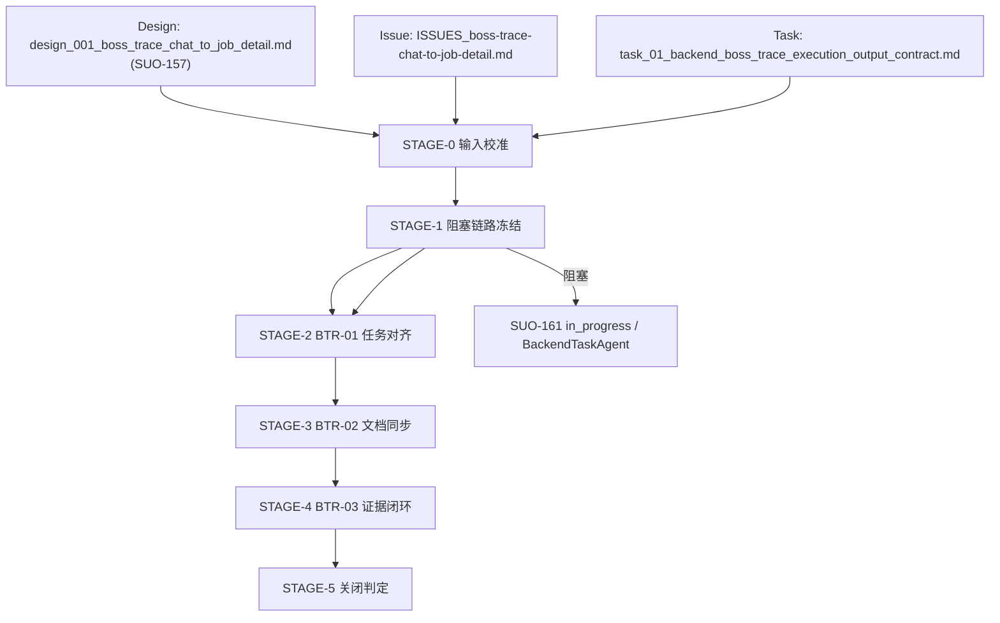

# Stage Plan: SUO-159 下游 Issue/Task/Stage/Exec 链路重建（左侧对话全量目标）

Stage ID: `STAGE-SUO-159-BOSS-TRACE-LEFT-PANEL-REBUILD`

Stage readiness verdict: `blocked`

## 关联设计稿

- [design_001_boss_trace_chat_to_job_detail.md](/Users/dmeck/project/boss-agent/docs/design/design_001_boss_trace_chat_to_job_detail.md)（`SUO-157`）

## 任务输入来源说明

- [docs/issue/ISSUES_boss-trace-chat-to-job-detail.md](/Users/dmeck/project/boss-agent/docs/issue/ISSUES_boss-trace-chat-to-job-detail.md)（问题边界与验收）
- [docs/task/task_01_backend_boss_trace_execution_output_contract.md](/Users/dmeck/project/boss-agent/docs/task/task_01_backend_boss_trace_execution_output_contract.md)（BTR-01）
- [docs/task/TASK-REQUIREMENT-FORMAT.md](/Users/dmeck/project/boss-agent/docs/task/TASK-REQUIREMENT-FORMAT.md)
- [docs/stage/stage_suo_150_boss_trace_per_contact_chain_backend.md]（历史 Stage 作废参照）
- [docs/stage/stage_suo_162_boss_trace_left_panel_coverage_contract.md]（历史计划继承）

## 当前进度

| 阶段 | 任务 | 状态 |
| --- | --- | --- |
| STAGE-0 | 输入齐备与阻断重识别 | 完成 |
| STAGE-1 | 下游链路重建: SUO-161 → SUO-162 → SUO-163 | 阻塞（等待 SUO-161） |
| STAGE-2 | downstream handoff 约束与阻断条件冻结（BTR-01/02/03） | 未开始 |
| STAGE-3 | 文档与交付门禁：显式 supersede 旧狭隘口径 | 未开始 |
| STAGE-4 | 刷新 normal + inspect 证据闭环 | 未开始 |
| STAGE-5 | 发起执行关闭前置条件确认 | 未开始 |

## 阶段任务表

| 阶段 | 任务 | 产出 | 依赖 | 风险 |
| --- | --- | --- | --- | --- |
| STAGE-0 | 锁定 `SUO-157` 为链路源，校验 task/stage 输入仍与左侧覆盖一致 | 输入一致性说明 | 设计稿可读 | 设计与执行边界漂移 |
| STAGE-1 | 明确阻塞链：`SUO-161`（BackendTaskAgent）必须完成后，`SUO-162`（StagePlanner）再执行，`SUO-163`（ExecTaskAgent）随后 | 阶段 gating 文本与责任人映射 | STAGE-0 | 误发起下游任务导致并行冲突 |
| STAGE-2 | 将 `SUO-162` 任务目标定义为三项：覆盖口径冻结、单会话单联系人、单岗位证据边界 | 下游 stage handoff 清单（BTR-01/02/03） | SUO-161 完成 | 旧任务模板未同步 |
| STAGE-3 | 更新/追加 stage 层与 issue handoff 文本，要求 1) 左侧列表 source-of-truth 2) targetId/leftIndex/targetProvenance 3) `--inspect-selectors` 为 debug-only | Stage 2 兼容草案（左侧覆盖 superset） | STAGE-2 | 文档与执行顺序错位 |
| STAGE-4 | 要求 `SUO-163` 以 refresh evidence 完成 normal + inspect 分离验证（左侧对话集合、单 open/session、单 job per target） | 新鲜 runtime 证据（或明确外部 blocker） | SUO-162 完成 | 环境阻塞（登录/CAPTCHA/风控） |
| STAGE-5 | 根据证据更新 `SUO-159` 闭环状态：有证据则关闭；无证据则记录 blocker owner/action | 闭环决议路径与阻塞条目 | STAGE-4 | 证据不足导致误闭环 |

## 阶段说明

### STAGE-0 输入校准与阻断重识别

并行/串行标记: 串行。  
准入条件: `docs/design/design_001_boss_trace_chat_to_job_detail.md` 与 `docs/task/task_01_backend_boss_trace_execution_output_contract.md` 可读。  
阶段产出 checklist:
- [x] `SUO-159` 的范围确认：目标覆盖以左侧会话列表为真源。
- [x] 旧 contract 的冲突条目识别：`traceTargets` 与单一 `王攀盼`基线不再是 normal 完整目标集。
- [ ] `SUO-161` 已恢复并可交付 stage/exec 之前续航证据。

### STAGE-1 链路重建：阻塞顺序冻结

并行/串行标记: 串行。  
准入条件: STAGE-0 完成。  
阶段产出 checklist:
- [ ] 明确 `SUO-161 -> SUO-162 -> SUO-163` 的硬依赖。
- [ ] 指定阻塞 Owner：`SUO-161` 由 `BackendTaskAgent` 继续推进。
- [ ] 标注 `SUO-162` 不在 `SUO-161` 完成前启动。

### STAGE-2 任务对齐冻结（BTR-01）

并行/串行标记: 串行。  
准入条件: STAGE-1 完成。  
阶段产出 checklist:
- [ ] 下游 task 包明确 `target` 来源从左侧对话列表构建，`traceTargets` 为兼容 overlay。
- [ ] 明确 `--inspect-selectors` 仅作为 debug，不承接 normal 证据。

### STAGE-3 文档与可交付口径同步（BTR-02）

并行/串行标记: 并行后收敛。  
准入条件: STAGE-2 完成。  
阶段产出 checklist:
- [ ] Stage 文档明确 supersede 旧有“单目标/有限目标”表述。
- [ ] 记录 `trace-target` 去重和 `leftIndex`、`targetProvenance`。
- [ ] 记录推荐页与未知岗位 URL 的排除规则。

### STAGE-4 运行证据闭环（BTR-03）

并行/串行标记: 串行。  
准入条件: STAGE-2 与 STAGE-3 完成。  
阶段产出 checklist:
- [ ] fresh evidence: normal trace 与 `--inspect-selectors` 同步报告左侧对话覆盖集基数。
- [ ] 证据显示每目标最多一条 normal job 成功链路。
- [ ] 证据显示同会话、单 open。
- [ ] 缺少证据时给出 blocker 明细与最小复现命令。

### STAGE-5 关闭判定

并行/串行标记: 串行。  
准入条件: STAGE-4 完成。  
阶段产出 checklist:
- [ ] `SUO-159` 从 blocked 转入 in_review 或 done。
- [ ] 明确是否需要重新分派子问题。

## 关键路径

1. STAGE-0
2. STAGE-1（`SUO-161`）
3. STAGE-2（`SUO-162`）
4. STAGE-3（`SUO-162`）
5. STAGE-4（`SUO-163`）
6. STAGE-5

## 风险与缓冲策略

- 阻塞失真风险：`SUO-161` 结果与实际代码证据不同步。缓冲：`SUO-159` 保持 blocked，不提前标记 done。
- 文档漂移风险：历史 stage 文档仍写旧单目标口径。缓冲：BTR-02 作为必须 gate。
- 证据缺口风险：环境阻塞导致无 fresh evidence。缓冲：要求记录具体 blocker owner 与下一动作。
- 并发误排：若 `SUO-162` 与 `SUO-163` 交叠执行，可能遗漏 BTR-01 边界。缓冲：以 STAGE-1 顺序强制。

## Mermaid 图

## 完成信号说明

- 当前文档为 `SUO-159` 的 stage 重建计划，当前可执行状态为 `blocked`，阻塞点为 `SUO-161`.
- 只有在 `SUO-161` 形成明确的 task 包与下游 handoff 变更后，`STAGE-1` 才能进入进行，随后顺序驱动 `SUO-162` 与 `SUO-163`。
- `SUO-159` 的关闭条件：
  - `SUO-162` 与 `SUO-163` 的交付均出现 fresh evidence，或
  - 记录外部 blocker（含 owner+next action）形成可恢复计划。
