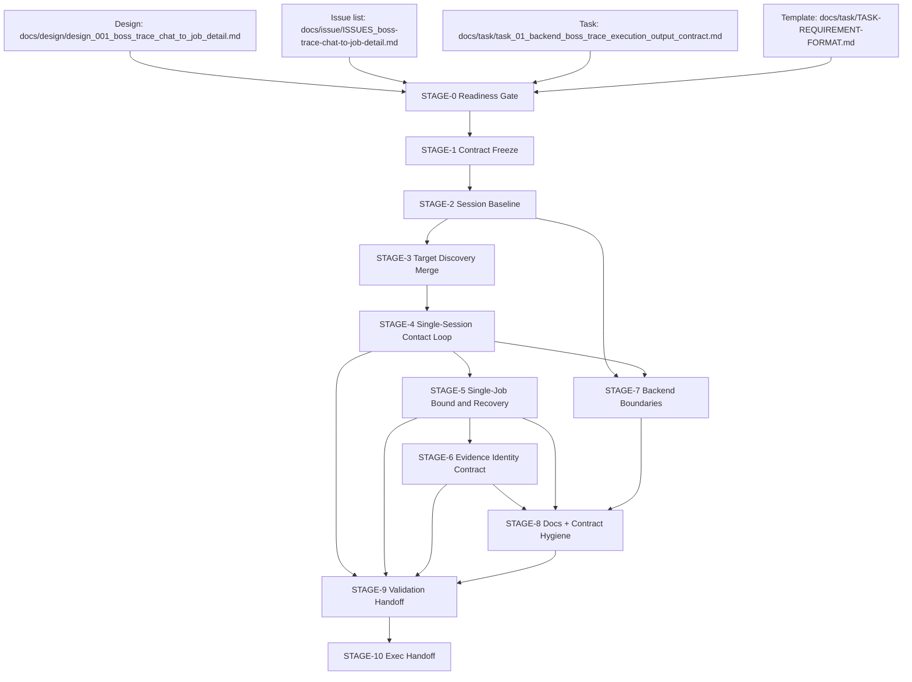

# Stage Plan: SUO-162 Left-Panel Coverage Contract Rebuild for BOSS Trace

Stage ID: `STAGE-SUO-162-BOSS-TRACE-LEFT-PANEL-COVERAGE`

Stage readiness verdict: `execute-ready`

## 关联设计稿

- [design_001_boss_trace_chat_to_job_detail.md](/Users/dmeck/project/boss-agent/docs/design/design_001_boss_trace_chat_to_job_detail.md)

## 任务输入来源说明

- [task_01_backend_boss_trace_execution_output_contract.md](/Users/dmeck/project/boss-agent/docs/task/task_01_backend_boss_trace_execution_output_contract.md)（BTR-01 对齐任务包）
- [TASK-REQUIREMENT-FORMAT.md](/Users/dmeck/project/boss-agent/docs/task/TASK-REQUIREMENT-FORMAT.md)
- [SUO-139-selector-inspection-multi-job-fix.md](/Users/dmeck/project/boss-agent/docs/task/SUO-139-selector-inspection-multi-job-fix.md)（历史兼容上下文）
- [SUO-133-boss-trace-flashing-fix.md](/Users/dmeck/project/boss-agent/docs/task/SUO-133-boss-trace-flashing-fix.md)（历史兼容上下文）
- [ISSUES_boss-trace-chat-to-job-detail.md](/Users/dmeck/project/boss-agent/docs/issue/ISSUES_boss-trace-chat-to-job-detail.md)
- 阶段重建背景：`SUO-150` 阶段已形成历史版本，不再作为当前执行基线，改为 superseded 参考。

## 任务输入完整性判定

- 设计稿、issue 清单、BTR-01 任务包和 `TASK-REQUIREMENT-FORMAT.md` 已齐备可读。
- `docs/task/SUO-139` 与 `docs/task/SUO-133` 为上下文锚点，可用于历史行为回归边界，不作为本期新增功能输入。
- 当前无输入级 BLOCKED 约束；可进入可执行计划状态（`execute-ready`）。

## 当前进度

| 阶段 | 任务 | 状态 |
| --- | --- | --- |
| STAGE-0 Readiness Gate | 输入一致性与范围收口确认 | 完成: `execute-ready` |
| STAGE-1 Left-Panel Coverage Contract Freeze | 明确全量左侧对话覆盖、`target_id`、`leftIndex`、`targetProvenance` 合约 | 未开始: downstream execute |
| STAGE-2 Session Baseline & Launch Args | 固定单入口命令基线和 `agent-browser` 必要参数 | 未开始: downstream execute |
| STAGE-3 Target Discovery Merge | 左侧列表发现 + `traceTargets` 覆盖合并，去重+排序，生成可执行目标图 | 未开始: downstream execute |
| STAGE-4 Single-Session Contact Loop | 构建一次 open + 每目标单次上下文遍历链路 | 未开始: downstream execute |
| STAGE-5 Single-Job Bound and Recovery | 每目标仅首个会话内有效岗位，失败可恢复、外部阻塞 abort | 未开始: downstream execute |
| STAGE-6 Evidence Identity Contract | `target_id`、`leftIndex`、`targetProvenance`、URL-derived `job_id` 写入 chats/jobs/trace-events | 未开始: downstream execute |
| STAGE-7 Backend Boundaries & Modules | 拆分 orchestration/command/output/parser 与测试点 | 未开始: downstream execute |
| STAGE-8 Docs + Contract Hygiene (BTR-02) | 任务、README、trace 指南同步左侧覆盖合同并标注 superseded | 未开始: downstream execute |
| STAGE-9 Validation Handoff (BTR-03) | 验收证据收口，验证 normal 与 `--inspect-selectors` 不混淆 | 未开始: downstream execute |
| STAGE-10 Exec Handoff | 写明下游推进前置与交付信号 | 未开始: downstream execute |

## 阶段任务表

| 阶段 | 任务 | 产出 | 依赖 | 风险 |
| --- | --- | --- | --- | --- |
| STAGE-0 Readiness Gate | 串行: 固定输入边界、合同版本与执行态范围 | `execute-ready` 与输入一致性说明 | 设计稿、任务清单、issue 清单 | 输入误读导致沿用旧单 target 合同 |
| STAGE-1 Left-Panel Coverage Contract Freeze | 串行: 以 left-panel 列表为 source-of-truth，定义 `leftIndex` 与 `targetProvenance` | `coverage-contract` 明细（discovered/fallback/config-only） | STAGE-0 | 覆盖面回退或重复执行导致重复采集 |
| STAGE-2 Session Baseline & Launch Args | 串行: 固定 `agent-browser` 单一 launch-arg 基线与 command logging | 全量命令路径合规规则 | STAGE-0 | 某些 batch 路径漏注入 `--extension`、`--state` |
| STAGE-3 Target Discovery Merge | 串行: 从左侧会话顺序构建 target set，覆盖/补丁 `traceTargets` 与 locator fallback | `resolvedTargets` 有序集合、去重规则 | STAGE-1, STAGE-2 | 去重策略错误导致顺序漂移与遗漏 |
| STAGE-4 Single-Session Contact Loop | 串行: 单 open、列表→联系人→聊天→作业→返回，逐联系人串行执行 | 无重复 open 的主链路执行规范 | STAGE-3, STAGE-2 | 被迫重复 open 导致闪烁回归 |
| STAGE-5 Single-Job Bound and Recovery | 串行: 每目标只认首个当前会话绑定岗位；失败策略明细化 | `job-not-collected`、`job-rejected`、`blocker` 事件规范 | STAGE-4 | 误把非阻塞失败转成全局 abort |
| STAGE-6 Evidence Identity Contract | 并行（后融合）: `chats/jobs/events` 写入目标身份与 URL-derived `job_id`，并过滤 recommendation/noise | 可审计 artifact schema 与去重规则 | STAGE-3, STAGE-4, STAGE-5 | URL 解析偏差导致重复写入或错误去重 |
| STAGE-7 Backend Boundaries & Modules | 并行: 保持入口层简化，拆分 `targets/commands/output/parser` 边界 | 代码边界改造草图与接口约束 | STAGE-2 | 大范围重构带来回归风险 |
| STAGE-8 Docs + Contract Hygiene (BTR-02) | 并行: 更新 README 与 trace 指南；明示单目标单 job 与 superseded 假设 | 文档一致性证明点（与 design/task 一致） | STAGE-1, STAGE-3, STAGE-6 | 文档先行于实现，导致过承诺 |
| STAGE-9 Validation Handoff (BTR-03) | 串行: `bun run check`、`bun run trace:dry`、`bun run trace`、`--inspect-selectors` 与证据核验 | 验收结论 + `BTR-03` handoff 草案 | STAGE-4, STAGE-5, STAGE-6, STAGE-7, STAGE-8 | 外部 blocker（登录/CAPTCHA/风控） |
| STAGE-10 Exec Handoff | 串行: 发起 `ExecTaskAgent` 下轮执行，写明 `BTR-01`→`BTR-02`→`BTR-03` 依赖顺序 | 下游执行前置条件与阻塞清单 | STAGE-9 | 缺失执行确认导致任务未闭环 |

## STAGE-0 Readiness Gate

并行/串行标记: 串行。

准入条件:

- 已读取并确认 design/task/issue 输入可读且版本一致。
- 当前阶段定位为 `SUO-162` 重建，不扩展实现/前端/exec 任务。
- 阶段目标与 `TASK-REQUIREMENT-FORMAT.md` 的输入来源一致。

阶段产出 checklist:

- [x] 确认输入目录与关键约束（左侧覆盖、单会话、单目标单 job）一致。
- [x] 明确本轮不重写上游文档，仅输出 stage plan。
- [x] 判定 `execute-ready`。

## STAGE-1 Left-Panel Coverage Contract Freeze

并行/串行标记: 串行。

准入条件:

- STAGE-0 完成。

阶段产出 checklist:

- [ ] 定义 `traceTargets` 仅用于 metadata override，不再收窄目标覆盖。
- [ ] 固定 `trace-target` 去重键（locator 签名）与稳定顺序规则。
- [ ] 强制 `leftIndex` 赋值规则：以发现顺序为主，保底 fallback 目标也保留 provenance 与可追溯来源。
- [ ] 明确高优先级风险项：left-panel 漂移、虚拟列表重排、配置项失配。

## STAGE-2 Session Baseline & Launch Args

并行/串行标记: 串行。

准入条件:

- STAGE-0 完成。

阶段产出 checklist:

- [ ] 统一 `agent-browser` 基础参数：两个 extension、auth state、`--headed` 全路径出现。
- [ ] 固定命令日志可审计：`output/agent-browser-commands.log` 包含全部 batch 命令。
- [ ] 验证 normal / dry / inspect 模式都走统一入口。

## STAGE-3 Target Discovery Merge

并行/串行标记: 串行（并可预先产出规则草案再串行收敛）。

准入条件:

- STAGE-1 与 STAGE-2 完成。

阶段产出 checklist:

- [ ] 输出 `resolvedTargets` DAG（`target_id`, `leftIndex`, `targetProvenance`）。
- [ ] 输出未命中项追踪（`trace-target-not-found`、`config-only`）。
- [ ] 明确 `chat-list` 与 override 合并后每目标的一次性处理边界。

## STAGE-4 Single-Session Contact Loop

并行/串行标记: 串行。

准入条件:

- STAGE-2 与 STAGE-3 已确认并可执行。

阶段产出 checklist:

- [ ] normal flow 保持一次 `open https://www.zhipin.com/web/geek/chat`。
- [ ] 每目标执行路径：chat-list -> select contact -> collect chat -> select job -> collect job -> return-to-chat/back。
- [ ] 禁止在目标间重复 `open https://www.zhipin.com/web/geek/chat`。
- [ ] `returnToChat` 统一采用 in-session 返回策略。

## STAGE-5 Single-Job Bound and Recovery

并行/串行标记: 串行。

准入条件:

- STAGE-4 完成。

阶段产出 checklist:

- [ ] per-target job 选择只接受第一个当前会话绑定有效岗位。
- [ ] 明确过滤条件：`job_sug_*`、`/recommend/`、非当前会话绑定不接收。
- [ ] 记录 `job-not-collected`、`job-rejected`、`target-aborted` 等失败原因。
- [ ] 仅外部 blocker（登录/CAPTCHA/风控/会话丢失/站点不可用）才 abort 全局。

## STAGE-6 Evidence Identity Contract

并行/串行标记: 并行（收敛后统一验收）。

准入条件:

- STAGE-3 与 STAGE-5 已有可审计字段。

阶段产出 checklist:

- [ ] `output/chats.json` 与 `output/jobs.json` 至少包含 `target_id`、`targetProvenance`、`leftIndex`（可发现时）。
- [ ] `jobs.json` 仅写 URL-derived `job_id`，并用 dedupe 跳过重复 `(target_id, job_id)`。
- [ ] `output/trace-events.json` 追踪 target/job 事件与状态变迁。
- [ ] 证据文件命名与过滤规则与 artifact 协议一致。

## STAGE-7 Backend Boundaries & Modules

并行/串行标记: 并行。

准入条件:

- STAGE-2 完成（命令基线明确）。

阶段产出 checklist:

- [ ] `src/trace-boss.ts` 保持入口调度职责，非单点承载 parser/filter/output。
- [ ] 明确可拆分模块边界与接口契约（targets/commands/output/parser）。
- [ ] 下游验证点清晰到文件级别。

## STAGE-8 Docs + Contract Hygiene (BTR-02)

并行/串行标记: 并行，最终依赖 STAGE-1/3/6 输出。

准入条件:

- 左侧覆盖与单目标单 job 规则已可验证。

阶段产出 checklist:

- [ ] 更新文档语义：`leftIndex`、`targetProvenance`、`target_id`、`job_id`、单会话、单目标单 job、continue-vs-abort。
- [ ] 明确推荐/未知岗位不作为 normal 完成证据。
- [ ] 将旧假设标注为 superseded 而非静默替换。

## STAGE-9 Validation Handoff (BTR-03)

并行/串行标记: 串行。

准入条件:

- STAGE-4 到 STAGE-8 已收敛。

阶段产出 checklist:

- [ ] 新鲜运行证据（或外部阻塞精确 stop-point + 命令生成证明）。
- [ ] 证明 normal mode 单 open/单会话。
- [ ] 证明每 target 最多 1 条 normal 成功 job。
- [ ] 证明 inspect 模式使用同一 resolved target cardinality。
- [ ] 形成 BTR-03 验收文本与交付清单。

## STAGE-10 Exec Handoff

并行/串行标记: 串行。

准入条件:

- STAGE-9 产出可审计完成证据。

阶段产出 checklist:

- [ ] 通知下游执行 owner 进入 `Execution`。
- [ ] 明确依赖链路：BTR-01 -> BTR-02 -> BTR-03。
- [ ] 说明剩余阻塞风险与回退条件。

## 关键路径

1. STAGE-0 Readiness Gate
2. STAGE-1 Left-Panel Coverage Contract Freeze
3. STAGE-2 Session Baseline & Launch Args
4. STAGE-3 Target Discovery Merge
5. STAGE-4 Single-Session Contact Loop
6. STAGE-5 Single-Job Bound and Recovery
7. STAGE-6 Evidence Identity Contract
8. STAGE-8 Docs + Contract Hygiene (BTR-02)
9. STAGE-9 Validation Handoff (BTR-03)
10. STAGE-10 Exec Handoff

## 风险与缓冲策略

- 目标列表漂移风险：左侧列表重排导致 `leftIndex` 与顺序变化。缓冲：以 locator 签名去重并保留 `chat-list` 证据。
- 误回归重复 open 风险：会话命令路径可能在隐式路径重引入 open chat。缓冲：STAGE-2 前置审核命令日志，STAGE-4 引入回归检查。
- 过滤与 job_id 风险：推荐/发现页误采样。缓冲：URL parse + 过滤规则写入 trace 事件并在 STAGE-6/9 做证据校验。
- 文档过早修改风险：文档先于实现更新。缓冲：STAGE-8 依赖 STAGE-1/3/6 与 STAGE-5/4 收敛结论。

## Mermaid DAG

## 完成信号说明

- `docs/stage/stage_suo_162_boss_trace_left_panel_coverage_contract.md` 已创建且写入。
- STAGE-0 结论为 `execute-ready` 且无输入阻塞。
- 当前计划文件已包含左侧对话覆盖收敛到 `target_id/leftIndex/targetProvenance` 的可审计链路、单会话单目标单 job 的执行边界、以及 `--inspect-selectors` 与 normal mode 的 cardinality 与证据隔离。
- 下游可依照 STAGE-10 进行 handoff：优先执行 BTR-01，再执行 BTR-02，最后 BTR-03。
