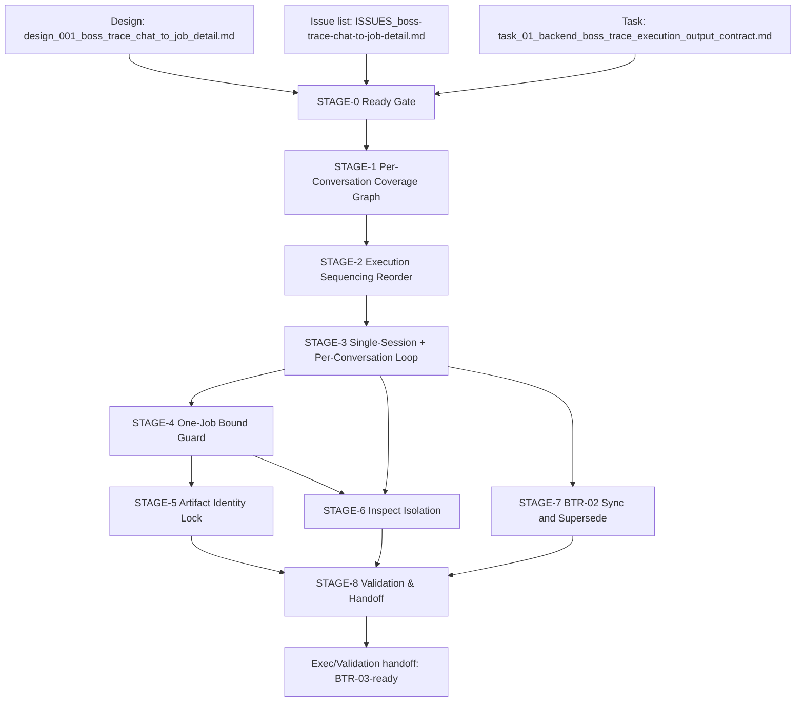

# Stage Plan: SUO-166 BOSS Trace Left-Panel Per-Conversation Execution Rebuild

Stage ID: `STAGE-SUO-166-BOSS-TRACE-LEFT-PANEL-PER-CONVERSATION`

Stage readiness verdict: `execute-ready`

## 关联设计稿

- [design_001_boss_trace_chat_to_job_detail.md](/Users/dmeck/project/boss-agent/docs/design/design_001_boss_trace_chat_to_job_detail.md)

## 任务输入来源说明

- Upstream contract: [design_001_boss_trace_chat_to_job_detail.md](/Users/dmeck/project/boss-agent/docs/design/design_001_boss_trace_chat_to_job_detail.md)
- Issue list: [ISSUES_boss-trace-chat-to-job-detail.md](/Users/dmeck/project/boss-agent/docs/issue/ISSUES_boss-trace-chat-to-job-detail.md)
- Stage-0 task package: [task_01_backend_boss_trace_execution_output_contract.md](/Users/dmeck/project/boss-agent/docs/task/task_01_backend_boss_trace_execution_output_contract.md)
- Historical correction context: [SUO-139-selector-inspection-multi-job-fix.md](/Users/dmeck/project/boss-agent/docs/task/SUO-139-selector-inspection-multi-job-fix.md), [SUO-133-boss-trace-flashing-fix.md](/Users/dmeck/project/boss-agent/docs/task/SUO-133-boss-trace-flashing-fix.md)
- Rebuild lineage (for dependency continuity): [stage_suo_159_boss_trace_left_panel_recovery.md](/Users/dmeck/project/boss-agent/docs/stage/stage_suo_159_boss_trace_left_panel_recovery.md), [stage_suo_150_boss_trace_per_contact_chain_backend.md](/Users/dmeck/project/boss-agent/docs/stage/stage_suo_150_boss_trace_per_contact_chain_backend.md), [stage_suo_162_boss_trace_left_panel_coverage_contract.md](/Users/dmeck/project/boss-agent/docs/stage/stage_suo_162_boss_trace_left_panel_coverage_contract.md)
- Scope lock: 仅写入 `docs/stage/`，不得改写 `docs/design/`、`docs/task/`、`docs/issue/`

输入完整性判定:

- 设计稿与 issue 清单可读。
- 目标 task 包可读且明确标注 left-panel coverage 与 per-target 单 job 行为。
- 无新增输入缺口；当前 issue 块位于重排状态下可进入阶段规划。

## 当前进度

| 阶段 | 任务 | 状态 |
| --- | --- | --- |
| STAGE-0 Ready Gate | 输入一致性确认与范围冻结 | 完成 |
| STAGE-1 Per-Conversation Coverage Graph | 输出目标覆盖拓扑并锁定 `leftIndex` 与 `targetProvenance` 策略 | 未开始 |
| STAGE-2 Execution Sequencing Reorder | 重排为“左侧会话发现→逐会话链路”主序列 | 未开始 |
| STAGE-3 Single-Session + Per-Conversation Loop | 固定同会话内逐条联系人/岗位链路，禁止多次 open | 未开始 |
| STAGE-4 One-Job Bound Guard | 每目标仅第一条会话内有效岗位采集，定义 continue/abort 策略 | 未开始 |
| STAGE-5 Artifact Identity Lock | 锁定 `target_id/leftIndex/targetProvenance/job_id` 与噪声过滤一致性 | 未开始 |
| STAGE-6 Inspect Isolation | 保持 `--inspect-selectors` 与 normal cardinality 一致且 debug-only | 未开始 |
| STAGE-7 BTR-02 Sync and Supersede | 统一文档口径（`docs`/合同）与 superseded 标注 | 未开始 |
| STAGE-8 Validation & Handoff | 验证模板 + 依赖链 handoff 与执行前置清单 | 未开始 |

## 阶段任务表

| 阶段 | 任务 | 产出 | 依赖 | 风险 |
| --- | --- | --- | --- | --- |
| STAGE-0 Ready Gate | 串行：确认设计-issue-task 输入一致、锁定 SUO-166 重排边界、建立交付前置 | execute-ready 与依赖说明 | 设计稿、Issue 清单、任务包 | 输入误读导致沿用旧 limited-target 合同 |
| STAGE-1 Per-Conversation Coverage Graph | 串行：重建 coverage DAG（left-panel 发现优先，`traceTargets` 仅 override） | `resolvedTargets` 与 provenance 决议（discovered/fallback/config-only） | STAGE-0 | 左侧列表漂移/虚拟列表重排导致顺序与去重边界变化 |
| STAGE-2 Execution Sequencing Reorder | 串行：将 stage 任务顺序从 per-target 限定改为 per-conversation 流程 | 目标执行序列约束文案（按 left-panel 顺序） | STAGE-1 | 依赖顺序错误导致 inspect 与 normal path 仍混淆 |
| STAGE-3 Single-Session + Per-Conversation Loop | 串行：主链路固定一次 open，多目标复用同 session（contact→chat→job→return/back） | 单 open 规约与 loop 失败恢复规则 | STAGE-2 | 误入重复 open(chat) 回归闪烁、上下文漂移 |
| STAGE-4 One-Job Bound Guard | 串行：每目标仅收一条当前会话绑定 job，超限或异常仅记失败并继续 | normal 单 job 套件与失败事件清单（job-not-collected/job-rejected） | STAGE-3 | 非阻塞失败被误判为全局 abort |
| STAGE-5 Artifact Identity Lock | 并行：锁定 `chats/jobs/trace-events` 的目标身份与 URL-derived `job_id` | 统一 artifacts schema 校验点、去重规则、排除列表生效点 | STAGE-1, STAGE-4 | URL 解析偏差导致 job evidence 错配 |
| STAGE-6 Inspect Isolation | 串行：将 inspect 从 normal 流程剥离，保持 resolved target cardinality 不变 | inspect debug 边界与证据判定条件 | STAGE-3 | 误将 inspect 产物作为 normal 完成证据 |
| STAGE-7 BTR-02 Sync and Supersede | 并行：下沉到 BTR-02 文档同步项，标注旧假设为 superseded | 文档一致性核对清单 | STAGE-3, STAGE-5, STAGE-6 | 文档早于实现可导致过承诺 |
| STAGE-8 Validation & Handoff | 串行：验证指令与证据模板，按 BTR-01→BTR-02→BTR-03 handoff |
  包含 `--inspect-selectors`/normal 分离与阻塞 stop-point | STAGE-4, STAGE-5, STAGE-6, STAGE-7 | 外部 blocker（登录/CAPTCHA/风控）导致缺 fresh evidence |

## STAGE-0 Ready Gate

并行/串行标记: 串行。

准入条件:

- 设计稿与 Issue 列表指向同一 left-panel coverage 合约。
- task 文档明确 `target_id/leftIndex/targetProvenance`、单会话、单目标单 job。
- 输出范围限制为 `docs/stage/`。

阶段产出 checklist:

- [x] 已确认输入来源与重排目标为 per-conversation 执行。
- [x] 已确认下游职责：`BackendTaskAgent` 为实现，`ExecTaskAgent` 为证据执行。
- [x] 已识别当前阻塞链（BTR-01、BTR-02、BTR-03）与目标序列。

## STAGE-1 Per-Conversation Coverage Graph

并行/串行标记: 串行。

准入条件:

- STAGE-0 完成。

阶段产出 checklist:

- [ ] 识别当前 left-panel conversation discovery 顺序（`COLLECT_CHAT_LIST`）为 target baseline。
- [ ] 定义 `traceTargets`/`conversationEntryLocators` 只做 override/compatibility，不收窄 normal flow。
- [ ] 明确去重键与 `leftIndex` 赋值规则。
- [ ] 明确未命中项事件（`trace-target-not-found`）。

## STAGE-2 Execution Sequencing Reorder

并行/串行标记: 串行。

准入条件:

- STAGE-1 的 `resolvedTargets` 输出可消费。

阶段产出 checklist:

- [ ] 重排 stage 执行顺序说明为：chat-list → resolved targets → per-conversation loop → handoff。
- [ ] 明确 STAGE-2 是对历史“有限/单目标叙事”的替换边界。

## STAGE-3 Single-Session + Per-Conversation Loop

并行/串行标记: 串行。

准入条件:

- STAGE-2 覆盖集合与顺序已冻结。

阶段产出 checklist:

- [ ] `bun run trace` normal path 固定一次 `open https://www.zhipin.com/web/geek/chat`。
- [ ] 每个目标在同一 session 里执行：click contact → chat context → select single valid job → collect job → return/back。
- [ ] 禁止目标间重复 open chat。
- [ ] 明确 `returnToChat` 优先策略。

## STAGE-4 One-Job Bound Guard

并行/串行标记: 串行。

准入条件:

- STAGE-3 的 per-conversation loop 方案可落地。

阶段产出 checklist:

- [ ] 每 `target_id` 仅 accept 第一条当前会话绑定 job。
- [ ] 明确过滤 `job_sug_*`、`/recommend/` 与未知岗位 URL。
- [ ] 非外部 blocker 时记录 `job-not-collected` 后继续下一个目标。
- [ ] 外部 blocker（登录/CAPTCHA/risk/session loss/site unavailable）才全局 abort。

## STAGE-5 Artifact Identity Lock

并行/串行标记: 并行。

准入条件:

- STAGE-1 与 STAGE-4 决议可执行。

阶段产出 checklist:

- [ ] 约束 `output/chats.json`、`output/jobs.json` 与 `output/trace-events.json` 全链路含 `target_id`。
- [ ] `jobs.json` 的 `job_id` 仅由 `/job_detail/<job_id>.html` 解析。
- [ ] `(target_id, job_id)` 去重与 `job-duplicate-skipped`。
- [ ] 在 `jobs` 与 raw/snapshot 中排除推荐/无关公司区块。

## STAGE-6 Inspect Isolation

并行/串行标记: 串行。

准入条件:

- STAGE-3 已明确 session 生命周期。

阶段产出 checklist:

- [ ] `--inspect-selectors` 保持 explicit opt-in。
- [ ] inspect 使用与 normal 一致的 resolved target 集，不收缩为 1。
- [ ] inspect 输出仅 debug evidence，不进入 normal 完成条件。

## STAGE-7 BTR-02 Sync and Supersede

并行/串行标记: 并行。

准入条件:

- STAGE-3 与 STAGE-5 条件成熟。

阶段产出 checklist:

- [ ] BTR-02 侧文档更新：`left-panel coverage`、`targetProvenance`、`target_id`、`job_id`、单会话与单目标单 job。
- [ ] 旧单/有限 target 假设明确标记为 superseded。
- [ ] 明确 recommendation 与 debug 迹证边界。

## STAGE-8 Validation & Handoff

并行/串行标记: 串行。

准入条件:

- STAGE-4, STAGE-5, STAGE-6, STAGE-7 完成。

阶段产出 checklist:

- [ ] `bun run check`。
- [ ] `bun run trace:dry`。
- [ ] `bun run trace`（或精确外部 blocker stop-point）。
- [ ] `bun run trace -- --inspect-selectors`（debug-only 证据与 cardinality 校验）。
- [ ] 形成 handoff：`BTR-01` 完成后进入 `BTR-02`，再进入 `BTR-03`。
- [ ] 记录 blocker owner/action（如 login/CAPTCHA/风控）。

## 关键路径

1. STAGE-0 Ready Gate
2. STAGE-1 Per-Conversation Coverage Graph
3. STAGE-3 Single-Session + Per-Conversation Loop
4. STAGE-4 One-Job Bound Guard
5. STAGE-5 Artifact Identity Lock
6. STAGE-6 Inspect Isolation
7. STAGE-8 Validation & Handoff

## 风险与缓冲策略

- 左侧列表漂移：左-panel 顺序或滚动窗口变化导致 `leftIndex` 反复波动。缓冲：采集 evidence 中保留 locator-signature 与 `chat-list` 证据。
- 目标收敛误差：`traceTargets` merge 仍可能误收窄覆盖。缓冲：`targetProvenance` 必须区分 discovered/fallback/config-only。
- 重复 open 回归：未隔离 inspect/normal 路径导致重复 open。缓冲：STAGE-3 将重复检测规则写入阶段检查项。
- external blocker：登录/CAPTCHA/风控阻断运行。缓冲：记录停止点、URL、阻塞事件与最小本地命令证明。

## Mermaid DAG

## 完成信号说明

- `docs/stage/stage_suo_166_boss_trace_left_panel_per_conversation_execution.md` 已生成。
- 输入一致性与范围已冻结（STAGE-0 已完成）。
- 所有阶段的准入条件、并行边界与交付 checklist 已输出，目标顺序已按 left-panel per-conversation 收敛。
- 下游执行前置：`BTR-01`（Backend implementation）→ `BTR-02`（contract docs）→ `BTR-03`（evidence/validation）。
